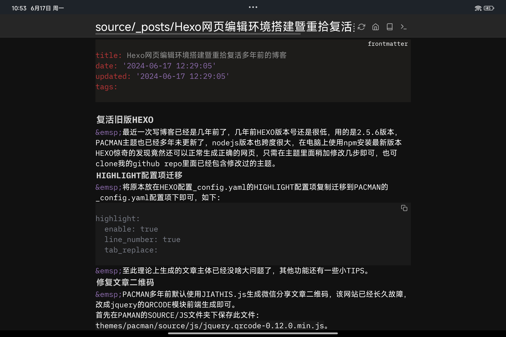
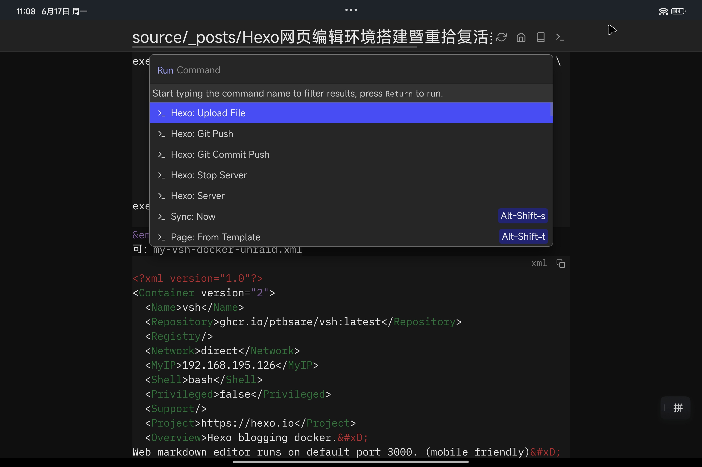
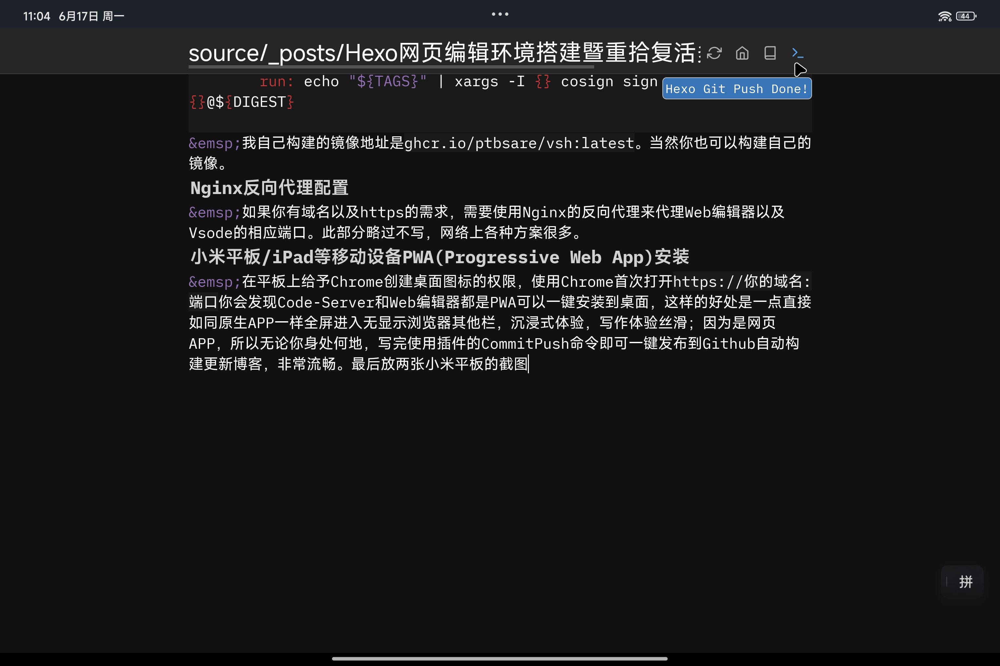

## 复活旧版HEXO
&emsp;最近一次写博客已经是几年前了，几年前HEXO版本号还是很低，用的是2.5.6版本，PACMAN主题也已经多年未更新了，nodejs版本也跨度很大，在电脑上使用npm安装最新版本HEXO惊奇的发现竟然还可以正常生成正确的网页，只需在主题里面稍加修改几步即可，也可clone我的github repo里面已经包含修改过的主题。
### HIGHLIGHT配置项迁移
&emsp;将原本放在HEXO配置_config.yaml的HIGHLIGHT配置项复制迁移到PACMAN的_config.yaml配置项下即可，如下:
```
highlight:
  enable: true
  line_number: true
  tab_replace:
```
&emsp;至此理论上生成的文章主体已经没啥大问题了，其他功能还有一些小TIPS。
### 修复文章二维码
&emsp;PACMAN多年前默认使用JIATHIS.js生成微信分享文章二维码，该网站已经长久故障，改成jquery的QRCODE模块前端生成即可。
首先在PAMAN的SOURCE/JS文件夹下保存此文件:`themes/pacman/source/js/jquery.qrcode-0.12.0.min.js`。
然后修改`themes/pacman/layout/_partial/after_footer.ejs`。
```javascript
//表头添加
<script src="<%- config.root %>js/jquery.qrcode-0.12.0.min.js"></script>
...
//在第100行this.append(html);下面添加如下几行即可：
  $('#qrcode-pic').qrcode({text: url, render: 'img', });
  $('.qrcode').hide();
  $('.article-share-qrcode').click(function(){
  $('.qrcode').toggle();
  });
  $('.qrclose').click(function(){
  $('.qrcode').hide();
  });
```
### 修复作者头像图片
&emsp;修改PACMAN里面_config.yaml内部的
```yaml
author_img: img/author.jpg
＃改为
author_img: ../img/author.jpg
```
&emsp;至此主题部分完全迁移完毕，没有问题，然后修改HEXO的_config.yaml对照最新版配置稍作修改兼容即可。
## 写作环境搭建
### HEXO迁移到Docker
&emsp;近来移动设备、平板、手机等越来越多，需要许多时候可以直接在移动设备上码字发布文章，因此在各种设备上安装nodejs以及HEXO是没有必要的，因此需要将HEXO变成Docker容器里面运行，在家中服务器上运行即可。
### 编辑器的选择
&emsp;市面上好的markdown编辑器有许多，但是各种客户端里面体验最好个人觉得还是Typora，但是Typora只有Mac客户端，无法兼顾移动端，跨平台的本地编辑器不同平台体验又各不相同，因此为了获得统一的体验减少学习成本，构想决定使用Web的自托管Markdown在线编辑器，这样不同设备只要安装了浏览器就可以获得一致的编辑体验，无需安装额外APP，成本最小。当然，也可以同时在服务器上安装Code-Server作为电脑端的后备方案。
### Docker搭建
&emsp;将上述所有APP打包到一个Dockerfile里面，编写如下，构建镜像运行即可，这样就一键搭建好了编辑写作环境。
```dockerfile
FROM node:latest
LABEL maintainer="ptbsare"
WORKDIR /space
ARG DEBIAN_FRONTEND="noninteractive"
ENV LANG=C.UTF-8
ENV PUID=1001
ENV PGID=100
ENV HOME="/config"
ENV SB_HOSTNAME=0.0.0.0
ENV SB_KV_DB="${HOME}/silverbullet.db"
ENV SB_FOLDER="/space"
ENV SB_PORT=3000
ENV HEXO_PORT=6000
ENV VS_PORT=9000
ENV ENABLE_WORKSPACE_TRUST=''
ENV DEFAULT_WORKSPACE="/space"
ENV SOURCE_ROOT="/space"
ENV GIT_USERNAME=user
ENV GIT_EMAIL=user@mail.com
ENV GIT_SOURCE=''
ENV GIT_DEPLOY=''
ENV HEXO_VERSION=latest
ENV AUTO_UPGRADE_LATEST=''
ENV AUTO_UPGRADE_VSCODE=''
ENV AUTO_UPGRADE_SB=''
RUN \
    echo "*** install nodejs hexo and runtime dependencies ***" && \
    apt update && apt install -y \
    psmisc \
    git \
    jq \
    libatomic1 \
    nano \
    net-tools \
    netcat-traditional \
    sudo  \
    curl \
    gosu \
    vim \
    git \
    tar \
    && npm install hexo-cli@${HEXO_VERSION} -g 
RUN \
  echo "*** install code-server ***" && \
  if [ -z ${CODE_RELEASE+x} ]; then \
    CODE_RELEASE=$(curl -sX GET https://api.github.com/repos/coder/code-server/releases/latest \
      | awk '/tag_name/{print $4;exit}' FS='[""]' | sed 's|^v||'); \
  fi && \
  mkdir -p /app/code-server && \
  curl -o \
    /tmp/code-server.tar.gz -L \
    "https://github.com/coder/code-server/releases/download/v${CODE_RELEASE}/code-server-${CODE_RELEASE}-linux-amd64.tar.gz" && \
  tar xf /tmp/code-server.tar.gz -C \
    /app/code-server --strip-components=1 && \
  echo "**** clean up ****" && \
  rm -rf \
    /config/* \
    /tmp/* \
    /var/lib/apt/lists/* \
    /var/tmp/* \
    /usr/share/man
RUN \
  echo "*** install deno ***" && \
  curl -fsSL https://deno.land/x/install/install.sh | sh && mv $HOME/.deno/bin/deno /usr/local/bin/deno 
ADD https://github.com/krallin/tini/releases/download/v0.19.0/tini-amd64 /usr/bin/tini
RUN \
  echo "*** install silverbullet ***" && \
  deno install -f --name silverbullet --root /usr/local  --unstable-kv --unstable-worker-options -A https://get.silverbullet.md -g
RUN SILVERBULLET_RELEASE=$(curl -sX GET https://api.github.com/repos/silverbulletmd/silverbullet/releases/latest \
      | awk '/tag_name/{print $4;exit}' FS='[""]' | sed 's|^v||') \
      && curl -L https://github.com/silverbulletmd/silverbullet/releases/download/${SILVERBULLET_RELEASE}/silverbullet.js -o /silverbullet.js
VOLUME /space
VOLUME ${HOME}
EXPOSE ${SB_PORT} ${VS_PORT} ${HEXO_PORT}
ADD entrypoint.sh /entrypoint.sh
RUN chmod +x /entrypoint.sh
ENTRYPOINT [ "/entrypoint.sh" ]
```

entrypoint.sh如下：
```bash
#!/bin/sh
#安装特定版本HEXO
if [ ! $HEXO_VERSION=='latest' ]; then
    npm install hexo-cli@$HEXO_VERSION -g
fi
#升级HEXO
[ ! -z ${AUTO_UPGRADE_HEXO} ] && \
echo "*** install latest hexo ***" && \
npm install hexo-cli@latest -g
#升级VSCODE
[ ! -z ${AUTO_UPGRADE_VSCODE} ] && \
echo "*** install latest code-server ***" && \
mkdir -p /app/code-server && \
CODE_RELEASE=$(curl -sX GET https://api.github.com/repos/coder/code-server/releases/latest \
| awk '/tag_name/{print $4;exit}' FS='[""]' | sed 's|^v||') \
&& curl -o /tmp/code-server.tar.gz -L \
"https://github.com/coder/code-server/releases/download/v${CODE_RELEASE}/code-server-${CODE_RELEASE}-linux-amd64.tar.gz" && \
tar xf /tmp/code-server.tar.gz -C /app/code-server --strip-components=1
#升级SB
[ ! -z ${AUTO_UPGRADE_SB} ] && \
echo "*** install latest silverbullet ***" && \
deno install -f --name silverbullet --root /usr/local  --unstable-kv --unstable-worker-options -A https://get.silverbullet.md -g && \
SILVERBULLET_RELEASE=$(curl -sX GET https://api.github.com/repos/silverbulletmd/silverbullet/releases/latest \
	      | awk '/tag_name/{print $4;exit}' FS='[""]' | sed 's|^v||') \
	            && curl -L https://github.com/silverbulletmd/silverbullet/releases/download/${SILVERBULLET_RELEASE}/silverbullet.js -o /silverbullet.js
#设置git用户名邮箱
chsh -s /bin/bash
[ ! -z ${GIT_USER} ] && git config --global user.name ${GIT_USER}
[ ! -z ${GIT_EMAIL} ] && git config --global user.email ${GIT_EMAIL}
#设置用户
if [ ! -z $PUID ] && [ ! -z $PGID ]; then
    groupadd -g $PGID vsh
    useradd -u $PUID -g $PGID vsh
    chown -R $PUID:$PGID $SB_FOLDER
    args="$@"
    USERNAME=vsh
    chsh -s /bin/bash $USERNAME
    [ -f $HOME/.gitconfig ] && mkdir -p /home/$USERNAME && cp $HOME/.gitconfig /home/$USERNAME/
    echo "Running  as $USERNAME (configured as PUID $PUID and PGID $PGID)"
fi


#克隆博客源码
[ ! "$(ls -A ${SOURCE_ROOT})" ] && [ ! -z ${GIT_SOURCE} ] && [ ! -z ${GIT_DEPLOY} ] && git clone ${GIT_SOURCE} ${SOURCE_ROOT} && git clone ${GIT_DEPLOY} ${SOURCE_ROOT}/.deploy_git && chown -R $PUID:$PGID $SOURCE_ROOT


if [ -z "$DISABLE_SILVERBULLET" ]; then
  gosu $USERNAME deno run -A --unstable-kv --unstable-worker-options /silverbullet.js $args &
fi

#启动vscode server
if [ -n "${PASSWORD}" ] || [ -n "${HASHED_PASSWORD}" ]; then
    AUTH="password"
else
    AUTH="none"
    echo "starting with no password"
fi

if [ -z ${PROXY_DOMAIN+x} ]; then
    PROXY_DOMAIN_ARG=""
else
    PROXY_DOMAIN_ARG="--proxy-domain=${PROXY_DOMAIN}"
fi


if [ -z ${ENABLE_WORKSPACE_TRUST+x} ]; then
    DISABLE_WORKSPACE_TRUST_ARG=""
else
    DISABLE_WORKSPACE_TRUST_ARG="--disable-workspace-trust"
fi

chown -R $PUID:$PGID $HOME $DEFAULT_WORKSPACE

gosu $USERNAME env HOME=$HOME /app/code-server/bin/code-server --extensions-dir /config/extensions --install-extension ms-ceintl.vscode-language-pack-zh-hans &

if [ ! -z ${CODE_PLUGIN} ] ; then
gosu $USERNAME env HOME=$HOME /app/code-server/bin/code-server --extensions-dir /config/extensions --install-extension  ${CODE_PLUGIN} &
fi

exec gosu $USERNAME env HOME=$HOME /app/code-server/bin/code-server \
                --bind-addr 0.0.0.0:${VS_PORT:-9000} \
                --user-data-dir ${HOME:-/config}/data \
                --extensions-dir ${HOME:-/config}/extensions \
                --disable-telemetry \
                --auth ${AUTH} \
                ${PROXY_DOMAIN_ARG} \
                ${DISABLE_WORKSPACE_TRUST_ARG} \
                ${DEFAULT_WORKSPACE:-/config/}

exec "$@"
```
&emsp;如果你碰巧服务器使用的是UNRAID系统，那么可以直接使用下面Dockerman模板即可：`my-vsh-docker-unraid.xml`
```xml
<?xml version="1.0"?>
<Container version="2">
  <Name>vsh</Name>
  <Repository>ghcr.io/ptbsare/vsh:latest</Repository>
  <Registry/>
  <Network>direct</Network>
  <MyIP>192.168.195.126</MyIP>
  <Shell>bash</Shell>
  <Privileged>false</Privileged>
  <Support/>
  <Project>https://hexo.io</Project>
  <Overview>Hexo blogging docker.&#xD;
Web markdown editor runs on default port 3000. (mobile friendly)&#xD;
Vscode server runs on default port 9000.&#xD;
Default workspace/Blog source repo/Markdown editor space folder: /space&#xD;
Vscode config/Home folder/DB folder: /config</Overview>
  <Category>HomeAutomation: Productivity: Tools:</Category>
  <WebUI/>
  <TemplateURL/>
  <Icon>https://avatars.githubusercontent.com/u/6375567?s=200&amp;amp;v=4</Icon>
  <ExtraParams>--dns 223.5.5.5</ExtraParams>
  <PostArgs/>
  <CPUset/>
  <DateInstalled>1717933456</DateInstalled>
  <DonateText/>
  <DonateLink/>
  <Requires/>
  <Config Name="/space" Target="/space" Default="" Mode="rw" Description="" Type="Path" Display="always" Required="false" Mask="false">/mnt/user/appdata/vsh/space</Config>
  <Config Name="CODE_PLUGIN" Target="CODE_PLUGIN" Default="" Mode="" Description="" Type="Variable" Display="always" Required="false" Mask="false">codeyu.vscode-hexo</Config>
  <Config Name="/config" Target="/config" Default="" Mode="rw" Description="" Type="Path" Display="always" Required="false" Mask="false">/mnt/user/appdata/vsh/config</Config>
  <Config Name="GIT_USER" Target="GIT_USER" Default="" Mode="" Description="" Type="Variable" Display="always" Required="false" Mask="false">ptbsare</Config>
  <Config Name="GIT_EMAIL" Target="GIT_EMAIL" Default="" Mode="" Description="" Type="Variable" Display="always" Required="false" Mask="false">496725701@qq.com</Config>
</Container>
```

&emsp;容器会默认在/space文件夹存放源码repo并作为web编辑器以及Code-Server的默认工作区，所有配置选项和变量详见上述文件，基本是开箱即用的，为了得到更好体验，可以安装下面两个插件。
### Code-Server插件：
&emsp;Code-Server已经原生有了Markdown支持，只需安装中文语言支持以及在商店下载安装ID为codeyu.vscode-hexo的vsx拓展提供HEXO命令基础支持即可。
&emsp;为了更便捷的HEXO图片插入以及编辑器预览，启用HEXO的`post_asset_folder: true`选项，同时安装`hexo-image-link`插件。
&emsp;在Code-Server里面更方便地插入、自动粘贴文章图片到相应文章目录，在Code-Server的工作区新增`.vscode/settings.json`如下：
```json
{
    "markdown.copyFiles.destination": {
        "*/**.md": "${documentBaseName}/${fileName}"
    }
}
```
&emsp;这样即能做到编辑器预览文章图片以及HEXO渲染文章图片两不误。
### Web编辑器HEXO插件
&emsp;Code-Server只是一个后备方案，界面太复杂了，我选择的Web编辑器是一个带有模板系统的编辑器，也可以通过插件完善它的功能，因此我自己也对应写了一个HEXO的插件实现了HEXO的各种命令以及GIT的各种命令方便REPO管理以及GITHUB同步与发布，同时该插件也内置Upload File命令也实现了类似Code-Server的自动保存图片到相应文章名目录的功能，适合HEXO编写，感兴趣的可以在这里安装。
(https://github.com/ptbsare/ptbsare.github.io/tree/main/silverbullet-plug-hexo)
## Github自动构建
### 博客网页自动构建
&emsp;之前使用的是本地hexo generate && hexo deploy命令编译与发布有点繁琐了，事实上可以通过直接push到Github触发自动的HEXO构建及发布更新，在源码工作区添加`.github/workflows/pages.yml`内容如下即可：
```yaml
name: Pages

on:
  push:
    branches:
      - main  # default branch

jobs:
  build:
    runs-on: ubuntu-latest
    steps:
      - uses: actions/checkout@v4
        with:
          token: ${{ secrets.GITHUB_TOKEN }}
          # If your repository depends on submodule, please see: https://github.com/actions/checkout
          submodules: recursive
      - name: Use Node.js 20
        uses: actions/setup-node@v4
        with:
          # Examples: 20, 18.19, >=16.20.2, lts/Iron, lts/Hydrogen, *, latest, current, node
          # Ref: https://github.com/actions/setup-node#supported-version-syntax
          node-version: '20'
      - name: Cache NPM dependencies
        uses: actions/cache@v4
        with:
          path: node_modules
          key: ${{ runner.OS }}-npm-cache
          restore-keys: |
            ${{ runner.OS }}-npm-cache
      - name: Install Dependencies
        run: npm install
      - name: Build
        run: npm run build
      - name: Upload Pages artifact
        uses: actions/upload-pages-artifact@v3
        with:
          path: ./publicpublic
  deploy:
    needs: build
    permissions:
      pages: write
      id-token: write
    environment:
      name: github-pages
      url: ${{ steps.deployment.outputs.page_url }}
    runs-on: ubuntu-latest
    steps:
      - name: Deploy to GitHub Pages
        id: deployment
        uses: actions/deploy-pages@v4
```
### Docker镜像自动构建
&emsp;还记得之前的一键环境Dockerfile镜像么，想要始终用上最新版本的HEXO/Web编辑器以及Code-Server，也可以借助Github自动构建最新镜像，一键集成最新版本，添加`.github/workflows/vsh-docker-publish.yml`内容如下：
```yaml
name: Docker

# This workflow uses actions that are not certified by GitHub.
# They are provided by a third-party and are governed by
# separate terms of service, privacy policy, and support
# documentation.

on:
  schedule:
    - cron: '35 18 28 * *'
  push:
    branches: [ "main" ]
    # Publish semver tags as releases.
    # tags: [ 'v*.*.*' ]

env:
  # Use docker.io for Docker Hub if empty
  REGISTRY: ghcr.io
  # github.repository as <account>/<repo>
  IMAGE_NAME: ptbsare/vsh


jobs:
  build:

    runs-on: ubuntu-latest
    permissions:
      contents: read
      packages: write
      # This is used to complete the identity challenge
      # with sigstore/fulcio when running outside of PRs.
      id-token: write

    steps:
      - name: Checkout repository
        uses: actions/checkout@v4

      # Install the cosign tool except on PR
      # https://github.com/sigstore/cosign-installer
      - name: Install cosign
        if: github.event_name != 'pull_request'
        uses: sigstore/cosign-installer@59acb6260d9c0ba8f4a2f9d9b48431a222b68e20 #v3.5.0
        with:
          cosign-release: 'v2.2.4'

      # Set up BuildKit Docker container builder to be able to build
      # multi-platform images and export cache
      # https://github.com/docker/setup-buildx-action
      - name: Set up Docker Buildx
        uses: docker/setup-buildx-action@f95db51fddba0c2d1ec667646a06c2ce06100226 # v3.0.0

      # Login against a Docker registry except on PR
      # https://github.com/docker/login-action
      - name: Log into registry ${{ env.REGISTRY }}
        if: github.event_name != 'pull_request'
        uses: docker/login-action@343f7c4344506bcbf9b4de18042ae17996df046d # v3.0.0
        with:
          registry: ${{ env.REGISTRY }}
          username: ${{ github.actor }}
          password: ${{ secrets.GITHUB_TOKEN }}

      # Extract metadata (tags, labels) for Docker
      # https://github.com/docker/metadata-action
      - name: Extract Docker metadata
        id: meta
        uses: docker/metadata-action@96383f45573cb7f253c731d3b3ab81c87ef81934 # v5.0.0
        with:
          images: ${{ env.REGISTRY }}/${{ env.IMAGE_NAME }}
          tags: |
            type=schedule,pattern={{date 'YYYYMMDD'}}
            type=raw,value=latest,enable={{is_default_branch}}

      # Build and push Docker image with Buildx (don't push on PR)
      # https://github.com/docker/build-push-action
      - name: Build and push Docker image
        id: build-and-push
        uses: docker/build-push-action@0565240e2d4ab88bba5387d719585280857ece09 # v5.0.0
        with:
          context: ./vsh/
          push: ${{ github.event_name != 'pull_request' }}
          tags: ${{ steps.meta.outputs.tags }}
          #labels: ${{ steps.meta.outputs.labels }}
          cache-from: type=gha
          cache-to: type=gha,mode=max

      # Sign the resulting Docker image digest except on PRs.
      # This will only write to the public Rekor transparency log when the Docker
      # repository is public to avoid leaking data.  If you would like to publish
      # transparency data even for private images, pass --force to cosign below.
      # https://github.com/sigstore/cosign
      - name: Sign the published Docker image
        if: ${{ github.event_name != 'pull_request' }}
        env:
          # https://docs.github.com/en/actions/security-guides/security-hardening-for-github-actions#using-an-intermediate-environment-variable
          TAGS: ${{ steps.meta.outputs.tags }}
          DIGEST: ${{ steps.build-and-push.outputs.digest }}
        # This step uses the identity token to provision an ephemeral certificate
        # against the sigstore community Fulcio instance.
        run: echo "${TAGS}" | xargs -I {} cosign sign --yes {}@${DIGEST}
```
&emsp;我自己构建的镜像地址是`ghcr.io/ptbsare/vsh:latest`。当然你也可以构建自己的镜像。
## Nginx反向代理配置
&emsp;如果你有域名以及https的需求，需要使用Nginx的反向代理来代理Web编辑器以及Vsode的相应端口。此部分略过不写，网络上各种方案很多。
## 小米平板/iPad等移动设备PWA(Progressive Web App)安装
&emsp;在平板上给予Chrome创建桌面图标的权限，使用Chrome首次打开`https://你的域名:端口`你会发现Code-Server和Web编辑器都是PWA可以一键安装到桌面，这样的好处是一点直接如同原生APP一样全屏进入无显示浏览器其他栏，沉浸式体验，写作体验丝滑；因为是网页APP，所以无论你身处何地，写完使用插件的CommitPush命令即可一键发布到Github自动构建更新博客，非常流畅。最后放几张小米平板的截图：

