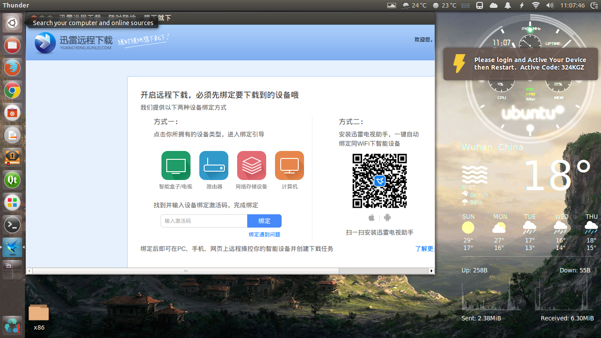
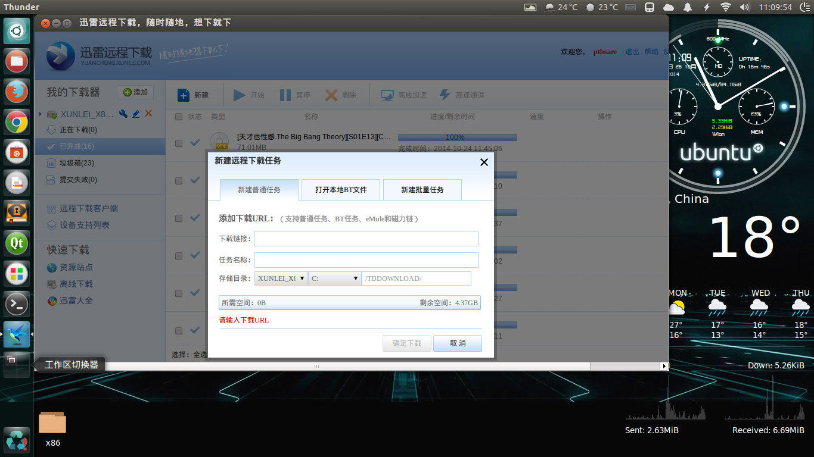

## 引言
鉴于国内如此比较恶劣的p2p下载环境，Linux下还没有一款"像样"的p2p下载软件，由于许多网站仅仅给出了迅雷下载链接或者ed2k，磁力链接，于是寻求一个Linux下的p2p下载软件替代。

前两天听闻迅雷推出了一个远程下载功能，所谓远程下载即在路由器上运行迅雷下载资源。并且迅雷在论坛里面提供了各个处理器平台的二进制文件，鉴于目前路由器上面跑的操作系统多数是Linux，值得注意的是，此次发布的路由器二进制文件其中包含了基于X86及glibc的构建版本，这就意味着它可以运行在桌面Linux上，于是萌生了让thunder跑在原生桌面Linux的想法。

## 简介
thunder的此路由器二进制构建项目名称为Xware([论坛地址](http://g.xunlei.com/forum-51-1.html))，发布的固件中包含了如下四个文件：

```
Xware1.0.31_x86_32_glibc/
├── EmbedThunderManager
├── ETMDaemon
├── portal
└── vod_httpserver
```
## 分析
### portal
经过测试发现，其中portal是入口文件，其它三个二进制文件由portal调用，portal运行后会产生两个进程`EmbedThunderManager`和`ETMDaemon`，其中`ETMDaemon`负责储存设备探测，它会自动扫描当前机器已经挂载的可写的储存设备并在其下面建立ThunderDB文件夹，同时在其中标记了该储存设备的uuid，然后将储存设备依次标记为`C：，D：，E：`盘，而且会在`/tmp`下建立`thunder/volumes/C:`等符号链接依次链接到各个设备。
### ETMDaemon
通过进一步测试我们发现要想被`ETMDaemon`捕获识别为可以存放下载文件的储存设备必须满足这么几个条件：
* 它是一个单独的被挂载的磁盘分区
* 该用户对该分区/目录有绝对的777权限

是的，听起来有点流氓，的确它就是这样，不过在后面我们可以采取一些措施来欺骗此检查。
### vod_httpserver
`vod_httpserver`负责在`127.0.0.1:9000`上面运行一个server，用浏览器打开`loaclhost:9000/getinfo`可以得到一串字符串，当然我们关心的就只有其中一段由大写字母组成的字符串，待会儿我们要用到。当然`loaclhost:9000/getinfo`这个地址是由`Xware-desktop`的项目作者对Xware二进制文件进行逆向工程得到的，开源社区的力量还真是强大，在此表示致敬。

## 远程下载
好了经过如上面的分析，下面来介绍一下迅雷的远程下载：
迅雷的远程下载大体经过一下几个步骤

* 其中绑定那步所用到的激活码也就是在上面分析中提到的那一串大写字母。
* 我们要做的工作就是让这一连串全自动化执行，以使得只用轻轻点一下鼠标就能进行添加任务下载。

## 自动化脚本实现
### Thunder Service
由于`portal`是以建立daemon的形式运行，因此最适合以服务的方式运行和调用，即用`sudo service thunder start`以及`sudo service thunder stop`就可以启动和终止服务，好在thunder远程下载论坛的一位老鸟已经做出了此`thunder service`脚本，在这里我们拿来用即可，脚本内容如下：
```bash
ptbsare@ptbsare-PC70:~$ cat /etc/init.d/thunder 
#! /bin/sh
### BEGIN INIT INFO
# Provides:          thunder
# Required-Start:    $local_fs $network
# Required-Stop:     $local_fs $network
# Default-Start:     2 3 4 5
# Default-Stop:      0 1 6
# Short-Description: Start/stop embed thunder manager
#
# Chkconfig: 2345 91 9
# Description: Start/stop embed thunder manager
### END INIT INFO
#
# Author: Pengxuan Men <pengxuan.men@gmail.com>
#

USER=thunder
XWAREPATH=/opt/Xware
RUN=$XWAREPATH/portal
LOG=$XWAREPATH/message.log

PATH=/sbin:/usr/sbin:/bin:/usr/bin
DESC="Embed Thunder Manager"
NAME=thunder
DAEMON=$XWAREPATH/lib/ETMDaemon
DNAME=ETMDaemon
PIDFILE=/var/run/$NAME/$NAME.pid
SCRIPTNAME=/etc/init.d/$NAME

# Exit if the package is not installed
[ -x "$RUN" ] || exit 5

# Read configuration variable file if it is present
#[ -r /etc/default/$NAME ] && . /etc/default/$NAME

# Define LSB log_* functions. Depend on lsb-base (>= 3.0-6)
. /lib/lsb/init-functions

# start the daemon/service

do_start()
{
    # Return
    #   0 if daemon has been started
    #   1 if daemon was already running
    #   2 if daemon could not be started

    # start_daemon -p $PIDFILE $DAEMON

    # Check if running
    if pidofproc -p $PIDFILE "$DAEMON" > /dev/null 2>&1 ; then
        return 1
    fi

    # Mount
    #umount -l /media/thunder 2>/dev/null
    #mount -B /home/ptbsare/Download/TDDownload /media/thunder

    # Run
    su $USER -c "$RUN" > $LOG 2>/dev/null

    # Check result
    local LAST=`cat $LOG | tail -n 1`
    [ "$LAST" = "finished." ] || return 2

    # Check if fail
    FAIL=`cat $LOG | tail -n 4 | grep fail`
    [ "$FAIL" != "" ] && return 2


    # Check ACTIVE CODE
    local MSG=""
    MSG=`cat $LOG | tail -n 4 | grep "ACTIVE CODE"`
    if [ "$MSG" != "" ] ; then
        cat $LOG | tail -n 5 | head -n 4 | while read l; do log_warning_msg $l; done
        return 2
    fi

    # Check if bound
    MSG=`cat $LOG | tail -n 4 | grep "BOUND TO USER"`
    if [ "$MSG" != "" ] ; then
        cat $LOG | tail -n 4 | head -n 3 | while read l; do log_warning_msg $l; done
        [ -e /var/run/$NAME ] || mkdir /var/run/$NAME
        ps aux | grep $DAEMON | grep -v grep | awk '{print $2}' > $PIDFILE
        return 0
    fi

    return 2
}

# stop the daemon/service

do_stop()
{
    # Return
    #   0 if daemon has been stopped
    #   1 if daemon was already stopped
    #   2 if daemon could not be stopped
    #   other if a failure occurred

    # killproc -p $PIDFILE $DAEMON

    local RET=0

    if pidof $DAEMON > /dev/null 2>&1 ; then
        if [ -e $PIDFILE ] && pidof $DAEMON | tr ' ' '\n' | grep -w $(cat $PIDFILE) > /dev/null 2>&1 ; then
            RET=2
        else
            RET=1
        fi
    else
        RET=0
    fi

    # RET is:
    # 0 if Deamon (whichever) is not running
    # 1 if Deamon (whichever) is running
    # 2 if Deamon from the PIDFILE is running

    if [ $RET = 0 ] ; then
        return 1
    elif [ $RET = 2 ] ; then
        su $USER -c "$RUN -s" > $LOG 2>/dev/null
        local COUNT=`cat $LOG | grep -c stopped`
        if [ $COUNT > 0 ] ; then
            # remove pidfile if daemon could not delete on exit.
            rm -f $PIDFILE
            return 0
        else
            FAIL=`cat $LOG | tail -n 1`
            return 2
        fi
    elif [ $RET = 1 ] ; then
        FAIL="There are processes named '$DNAME' running which do not match your pid file which are left untouched in the name of safety, Please review the situation by hand."
        return 2
    fi

    return 2
}

case "$1" in
  start)
    log_daemon_msg "Starting $DESC $NAME"

    do_start

    case "$?" in
        0|1) log_success_msg ;;
        *)   log_failure_msg "$FAIL" ;;
    esac
    ;;
  stop)
    log_daemon_msg "Stopping $DESC $NAME"

    do_stop

    case "$?" in
        0|1) log_success_msg ;;
        2)   log_failure_msg ;;
    esac
    ;;
  restart|force-reload)
    log_daemon_msg "Restarting $DESC $NAME"


    do_stop
    case "$?" in
      0|1)
        sleep 1
        do_start

        case "$?" in
            0) log_success_msg ;;
            1) log_failure_msg ;; # Old process is still running
            *) log_failure_msg ;; # Failed to start
        esac
        ;;
      *)
          # Failed to stop
        log_failure_msg
        ;;
    esac
    ;;
  status)
    status_of_proc -p $PIDFILE $DAEMON $DNAME && exit 0 || exit $?
    ;;
  *)

    log_warning_msg "Usage: $SCRIPTNAME {start|stop|restart|force-reload|status}" >&2
    exit 3
    ;;
esac

:

```
将其放到`/etc/init.d/`下：
```bash
sudo mv thunder /etc/init.d/
sudo chown root:root /etc/init.d/thunder
sudo chmod 0755 /etc/init.d/thunder
```
正常情况下`sudo service thunder start`会有这么几种输出：
* 倘若该下载器已经绑定，则输出会类似于:
```
 * Starting Embed Thunder Manager thunder
 * 
 * THIS DEVICE HAS BOUND TO USER: ptbsare.
 * 
 * 
```
* 若下载器尚未被绑定，则输出类似于：
```
 * Starting Embed Thunder Manager thunder
 *
 * THE ACTIVE CODE IS: BXZAMY
 *
 * go to http://yuancheng.xunlei.com, bind your device with the active code.
 *
```
* 若服务启动失败，则输出类似于：
```
 * Starting Embed Thunder Manager thunder
 * fail to start XXXX
```
### 权限用户thunder
* 细心的读者会注意到上述service文件中是以thunder这个用户运行的，事实上由于Xware比较流氓，原则上Xware只能以root用户运行，采用service的方式对权限问题进行了一定的优化，因此不得不新建立一个系统用户thunder以避免portal启动失败,在下面你也可以看到，权限问题至关重要，同时下载设备也要对thunder用户是777权限。
* 倘若我们就使用原来的用户来运行的话，你会发现在linux下挂载的Windows分区由于对当前系统是777权限，它都会被识别成下载储存设备，这显然不是我们需要的，因此有必要新建立一个thunder用户。
```bash
#新建系统用户thunder
sudo useradd -r thunder
```
### 储存设备检查
* 如前分析所述，Xware本身是要求`/`分区是777权限的，对于很多用户就只有一个根分区`/`，故不能开放777权限啊，所以我们可以采取一些措施来欺骗`ETMDaemon`的检查。
* 经过测试我们发现`ETMDaemon`识别的是设备，其实我们可以在`/media`下面挂载一些假的"设备",它都会被识别成储存设备，因此可以吧要存放下载文件夹挂载到/media下面就可以，不过要保证下载目的地文件夹为777权限，命令如下：
```bash
mkdir $HOME/Download/TDDownload
sudo mkdir /media/thunder
sudo chmod -R 777 $HOME/Download/TDDownload
sudo chown -R thunder:thunder $HOME/Download/TDDownload
sudo mount -B $HOME/Download/TDDownload /media/thunder
```
事实证明此方法可行。
### GUI套壳
由于提交下载任务等交互都是在网页中执行，可以给Xware套个壳子，chrome可以以app模式运行且可以指定窗口位置，大小，命令如下：
```bash
google-chrome --user-data-dir=$HOME/.thunder-x/chrome --window-size=1064,570 --window-position=100,100 --app=http://yuancheng.xunlei.com
```
### 流程图分析
要建立一个自动化的脚本，根据不同情况完成相应的动作，经过分析可以得到如下的程序流程图：

### 完整脚本
```bash
ptbsare@ptbsare-PC70:~$ cat /opt/Xware/start-thunder 
#!/bin/bash
if [ $USER == "thunder" ];then
echo "Please change current user."
notify-send "Please change current user." -i /opt/Xware/icon/before.ico
exit 1;
fi
SER=`service thunder status |awk '{print $4}'`
if [ "$SER" == "not" ];then
notify-send "Thunder Service is Starting..." -i /opt/Xware/icon/before.ico ;
gksudo -S -k /opt/Xware/mount&&
MSG=`cat /tmp/._code_|grep ACTIVE|awk -F ' ' '{print $6}'`
echo $MSG
#MSG=sudo service thunder start;
if [ "$MSG" != "" ];then
notify-send "Please login and Active Your Device then Restart.  Active Code: $MSG" -i /opt/Xware/icon/code.ico
notify-send "Please login and Active Your Device then Restart.  Active Code: $MSG" -i /opt/Xware/icon/code.ico
notify-send "Please login and Active Your Device then Restart.  Active Code: $MSG" -i /opt/Xware/icon/code.ico
notify-send "Please login and Active Your Device then Restart.  Active Code: $MSG" -i /opt/Xware/icon/code.ico
notify-send "Please login and Active Your Device then Restart.  Active Code: $MSG" -i /opt/Xware/icon/code.ico
notify-send "Please Restart After Activing." -i /opt/Xware/icon/restart.ico
notify-send "Please Restart After Activing." -i /opt/Xware/icon/restart.ico
fi
SER=`service thunder status |awk '{print $4}'`
if [ "$SER" == "running" ];then
notify-send "Thunder Service has Started Successfully!" -i /opt/Xware/icon/after.ico;
elif [ "$MSG" == "" ];then
notify-send "Thunder Service Fail to Start :   ETMDaemon is not running " -i /opt/Xware/icon/fail.ico ;
fi
fi
if [ -e /usr/bin/google-chrome ];then
if [ ! -d $HOME/.thunder-x/chrome ];then
mkdir -p $HOME/.thunder-x/chrome;
touch $HOME/.thunder-x/chrome/'First Run';
fi
google-chrome --user-data-dir=$HOME/.thunder-x/chrome --window-size=1064,570 --window-position=100,100 --app=http://yuancheng.xunlei.com; 
elif [ -e /usr/bin/google-chrome-unstable ];then
if [ ! -d $HOME/.thunder-x/chrome-un ];then
mkdir -p $HOME/.thunder-x/chrome-un
touch $HOME/.thunder-x/chrome-un/'First Run';
fi
/usr/bin/google-chrome-unstable --user-data-dir=$HOME/.thunder-x/chrome-un --window-size=1064,570 --window-position=100,100 --app=http://yuancheng.xunlei.com
elif [ -e /usr/bin/google-chrome-beta ];then
if [ ! -d $HOME/.thunder-x/chrome-be ];then
mkdir -p $HOME/.thunder-x/chrome-be
touch $HOME/.thunder-x/chrome-be/'First Run';
fi
/usr/bin/google-chrome-beta --user-data-dir=$HOME/.thunder-x/chrome-be --window-size=1064,570 --window-position=100,100 --app=http://yuancheng.xunlei.com
elif [ -e /usr/bin/chromium-browser ];then
if [ ! -d $HOME/.thunder-x/chromium ];then
mkdir -p $HOME/.thunder-x/chromium
touch $HOME/.thunder-x/chromium/'First Run';
fi
/usr/bin/chromium-browser --user-data-dir=$HOME/.thunder-x/chromium-browser --window-size=1064,570 --window-position=100,100 --app=http://yuancheng.xunlei.com
fi
echo "Done"
```
```bash
#mount挂载假设备
ptbsare@ptbsare-PC70:~$ cat /opt/Xware/mount 
#!/bin/bash
if [ -d $HOME/下载 ];then
mkdir -p $HOME/下载/TDDownload
if [ ! -e $HOME/下载/TDDownload/TDDOWNLOAD ];then
ln -s $HOME/下载/TDDownload $HOME/下载/TDDownload/TDDOWNLOAD
chmod -R 777 $HOME/下载/TDDownload
chown -R thunder:thunder $HOME/下载/TDDownload
fi
elif [ ! -d $HOME/Download ];then
mkdir -p $HOME/Download
chown $SUDO_USER:$SUDO_USER $HOME/Download
chmod 755 $HOME/Download
mkdir -p $HOME/Download/TDDownload
ln -s $HOME/Download/TDDownload $HOME/Download/TDDownload/TDDOWNLOAD
chmod -R 777 $HOME/Download/TDDownload
chown -R thunder $HOME/Download/TDDownload
else
mkdir -p $HOME/Download/TDDownload
ln -s $HOME/Download/TDDownload $HOME/Download/TDDownload/TDDOWNLOAD
chmod -R 777 $HOME/Download/TDDownload
chown -R thunder $HOME/Download/TDDownload
fi
service thunder start >/tmp/._code_&&
umount -l /media/thunder 2>/dev/null;
mount -B $HOME/Download/TDDownload /media/thunder
```
### 启动器及图标
* 启动器文件

使用`StartupWMClass`来匹配窗口启动器
```
ptbsare@ptbsare-PC70:~$ cat /usr/share/applications/thunder.desktop 
[Desktop Entry]
Name=Thunder
Comment=Open Thunder
Exec=/opt/Xware/start-thunder
Icon=/usr/share/icons/thunder.png
Terminal=false
Type=Application
StartupNotify=true
Categories=Network;FileTransfer;P2P;
OnlyShowIn=GNOME;Unity;
StartupWMClass=yuancheng.xunlei.com
```
* 考虑到友好的用户交互体验,在`notify-send`提示时总得弄几个好看的图标吧


### 运行效果
**下面发几张运行效果图**
**启动**

**绑定**


**运行**



## deb打包

* 上面只是在本地弄好启动，下面考虑将程序打包成`.deb`包。
* 将该程序项目起一个名字，命名为thunder-x项目。

### control File
首先`.deb`包必要一个`control`文件用来添加软件依赖等等，此处`control`文件的 写法如下：
```
Package: thunder-x
Architecture: all
Version: 0.1.0
Maintainer: ptbsare <ptbsare@gmail.com>
Depends: gksu, libnotify-bin, google-chrome-stable | goolge-chrome-beta | google-chrome-unstable | chromium-browser
Priority: optional
Description: p2sp thunder client.
 Thunder running on linux using Xware.
```
### postinst File
`postinst` 是在安装时所执行的设置脚本，参考[Debian Wiki](https://wiki.debian.org/MaintainerScripts)，软件在安装设置时`postinst configure`会被调用，此处我们需要一个`postinst`来建立thunder这个user等一系列工作，其写法如下：
```bash
#!/bin/sh
if cat /etc/passwd | awk -F : '{print $1}' | grep $name >/dev/null 2>&1
then
echo "User thunder already exists"
else
useradd -r thunder
fi
if [ ! -d /media/thunder ];then
mkdir -p /media/thunder
fi
chmod -R 777 /usr/share/thunder-x/Xware
chmod 0755 /etc/init.d/thunder
```
### 修改脚本并打包
* 由于打包成`.deb`后可供安装就要考虑适应很多中情况，所以就要对脚本进行修改，增添一些判断情况。
* 一切就绪后将文件夹命名为`程序名-版本号`的方式并按照以下目录组织放好就可以用dpkg打包了:
```bash
ptbsare@ptbsare-PC70:/tmp/dpkg-b$ tree thunder-x-0.1.0
thunder-x-0.1.0
├── DEBIAN
│   ├── control
│   └── postinst
├── etc
│   └── init.d
│       └── thunder
└── usr
    └── share
        ├── applications
        │   └── thunder.desktop
        └── thunder-x
            └── Xware
                ├── cfg
                │   ├── download.cfg
                │   └── etm.cfg
                ├── icon
                │   ├── after.ico
                │   ├── before.ico
                │   ├── code.ico
                │   ├── fail.ico
                │   ├── restart.ico
                │   ├── thunder.png
                │   └── user.ico
                ├── lib
                │   ├── EmbedThunderManager
                │   ├── ETMDaemon
                │   └── vod_httpserver
                ├── message.log
                ├── mount
                ├── online.html
                ├── portal
                └── start-thunder

11 directories, 21 files
```
可以看出来目录存放顺序完全是按照文件在目标机器上面的安装位置来的。
打包命令：
```bash
dpkg -b thunder-x-0.1.0/
```
这样就生成了一个thunder-x-0.1.0.deb的安装包可供安装。

## ppa发布
要想更方便地发布安装软件包，我们可以建立一个ppa来发布该软件包。
### 注册账户并创建ppa
到launchpad注册一个账户并创建一个ppa，ppa命名为thunder-x，如下图所示：


### 创建并导入openPGP 密钥
```bash
gpg –gen-key
gpg --send-keys --keyserver keyserver.ubuntu.com 12345678 
#12345678为你生成密钥中pub后的八位数字字母
```
登陆launchpad导入密钥指纹（fingerprint）

然后官方会给你发一封邮件，按照其中的指示，将邮件中的那部分不可读内容复制粘贴到例如file.txt中，然后：
```bash
gpg --decrypt file.txt
```
并照输出中的指示做。
### 上传sshkey
```bash
ssh-keygen -t rsa
```
登陆网站导入sshkey并粘贴`~/.ssh/id_rsa.pub`的内容。
### 创建源码包并上传
launchpad 只接受源码包并由它编译，因此我们需要另外创建一个可维护的debian源码包。
#### org.tar.gz
* 顾名思义，为上游源代码文件，在这里我们将所需的文件摆好并压缩成一个`org.tar.gz`包。
* 将上面的文件夹改名为`thunder-x_0.1.0.orig`,所需的文件按照下面的目录摆好并压缩成`thunder-x_0.1.0.orig.tar.gz`。
```bash
ptbsare@ptbsare-PC70:/tmp$ tree thunder-x_0.1.0.orig/
thunder-x_0.1.0.orig/
├── thunder
├── thunder.desktop
└── thunder-x
    └── Xware
        ├── icon
        │   ├── after.ico
        │   ├── before.ico
        │   ├── code.ico
        │   ├── fail.ico
        │   ├── restart.ico
        │   ├── thunder.png
        │   └── user.ico
        ├── lib
        │   ├── EmbedThunderManager
        │   ├── ETMDaemon
        │   └── vod_httpserver
        ├── message.log
        ├── mount
        ├── online.html
        ├── portal
        └── start-thunder

4 directories, 17 files
```

#### debian化
我们需要对上游的源码包进行debian化，新建一个`thunder-x-0.1.0`文件夹，里面新建debian文件夹，debian文件夹下应该有这么几个文件：
* changelog

指定相对于org所做出的更改以及编译ubuntu发行分支和维护者署名。
```
thunder-x (0.1.0) trusty; urgency=low

  * Initial release.

 -- ptbsare <ptbsare@gmail.com>  Mon, 26 Oct 2014 10:57:43 +0800

```
* control

指定编译所需依赖以及编译出的二进制包的依赖另外还有版本维护者等信息。
```
Source: thunder-x
Section: net
Priority: extra
Maintainer: ptbsare <ptbsare@gmail.com>
Build-Depends: debhelper (>= 8.0.0)
Standards-Version: 0.1.0

Package: thunder-x
Architecture: all
Depends: gksu, libnotify-bin, google-chrome-stable | goolge-chrome-beta | google-chrome-unstable | chromium-browser
Priority: optional
Description: p2sp thunder client.
 Thunder running on linux using Xware.

```
* dirs

安装后文件存放目录。
```
/usr/share
/usr/share/applications
/etc/init.d
```
* copyright

版权声明等信息，重要。
```
Format: http://dep.debian.net/deps/dep5
Upstream-Name: thunder-x
Source:  http://xunlei.com/

Files: *
Copyright: 2005-2014 Xunlei
License: Non-free

Files: debian/*
Copyright: 2014 ptbsare <ptbsare@gmail.com>
License: GPL-2+
 This package is free software; you can redistribute it and/or modify
 it under the terms of the GNU General Public License as published by
 the Free Software Foundation; either version 2 of the License, or
 (at your option) any later version.
 .
 This package is distributed in the hope that it will be useful,
 but WITHOUT ANY WARRANTY; without even the implied warranty of
 MERCHANTABILITY or FITNESS FOR A PARTICULAR PURPOSE.  See the
 GNU General Public License for more details.
 .
 You should have received a copy of the GNU General Public License
 along with this program. If not, see <http://www.gnu.org/licenses/>
 .
 On Debian systems, the complete text of the GNU General
 Public License version 2 can be found in "/usr/share/common-licenses/GPL-2".

# Please also look if there are files or directories which have a
# different copyright/license attached and list them here.
```
* install

文件的摆放对应位置，编译时依据此确定deb包中的文件目录结构摆放。
```
thunder /etc/init.d
thunder-x /usr/share
thunder.desktop /usr/share/applications
```
* rules

编译命令，相当于一个makefile，由于在这里不需要编译什么东西，我们保持默认。
```
#!/usr/bin/make -f
# -*- makefile -*-

%:
	dh $@ 
```
* md5sums

md5信息。
* postinst

同上，不再赘述。

#### 目录结构放好
```
thunder-x-0.1.0/
└── debian
    ├── changelog
    ├── compat
    ├── control
    ├── copyright
    ├── dirs
    ├── install
    ├── md5sums
    ├── postinst
    ├── rules
    └── source
        └── format

```
#### 打包
在thunder-x-0.1.0目录下：
```bash
debuild -S -sa
```
执行此步后会生成下面几个文件:
`thunder-x_0.1.0.debian.tar.gz`
`thunder-x_0.1.0_source.build`
`thunder-x_0.1.0_source.changes`
#### 上传
使用dput上传：
```bash
dput ppa:ptbsare/thunder-x thunder-x_0.1.0_source.changes
```
然后launchpad会在虚拟机里面给你编译，如果编译成功则就生成了二进制的deb包：

### ppa安装
最后，我们可以通过ppa进行安装：
**注：暂时只有14.04的i386构建版本，其他版本ubuntu请自行修改ppa的sourcelist为trusty。**
```bash
sudo apt-add-repository ppa: ptbsare/thunder-x
sudo apt-get update
sudo apt-get install thunder-x
```
**Enjoy!**
## 总结
经过以上步骤，我们就完成了折腾之旅，可以直接在不同的机器上用ppa安装使用的包，非常方便。在这期间也经过了无数次的失败和调试以及重新打包，深感开发者开发软件以及打包的不易，在此向那些默默无闻的开源社区开发者表示致敬。
以上也算是经过了完整的在ubuntu下的下开发->打包->发布的整个过程，因此本文也可以作为在ubuntu下开发软件以及打包发布的一个模版和例子。


<!-- Xware介绍，论坛地址，debian wiki，ppa打包介绍教程-->
**参考**：
(http://my.oschina.net/u/1382972/blog/285129)
(http://g.xunlei.com/thread-3290-1-1.html)
(https://wiki.debian.org/MaintainerScripts)
(http://blog.csdn.net/expleeve/article/details/5982170)
(http://www.liangsuilong.info/?p=1019)
([http://openyoudao.org/](http://openyoudao.org/%E5%A6%82%E4%BD%95%E5%9C%A8ubuntu%E7%B3%BB%E7%BB%9F%E4%B8%8B%E5%88%B6%E4%BD%9C%E8%87%AA%E5%B7%B1%E7%9A%84ppa%E5%AE%89%E8%A3%85%E5%8C%85))
