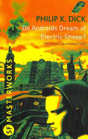
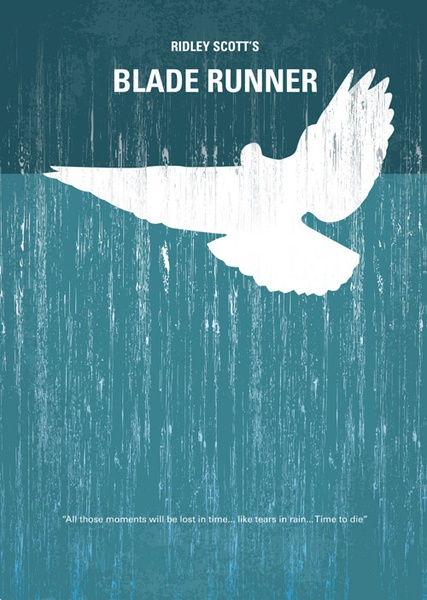

## 电影简介
《银翼杀手》为1982年的科幻电影，由雷德利·斯科特执导。
电影改编自Philip K.Dick 1968年的小说《Do Androids Dream of Electronic Sheep?》。

### 剧情摘要
二十一世纪初，泰勒公司先进机器人发展到了连锁阶段，那些机器人实际上和人类完全相同，被称为复制人，这些复制人在体力、敏捷度和智慧上都不错，被人类用于外世界从事奴隶的劳动、危险的探险工作及其他星球的殖民任务上，经过外界殖民地连锁六号战斗组的血腥暴动后，地球上宣布复制人为违法物——必须处死。特勤小组——银翼杀手受命侦查任何入侵复制人，并予以击毙。那不叫做处决，而是称之为退休。
Rick Deckard（Harrison Ford 饰）就是银翼杀手之一，某天，他奉命追踪潜入泰勒公司的复制人Roy Batty（Rutger Hauer 饰）、Zhora（Joanna Cassidy 饰）、Leon（Brion James 饰）和Pris（Daryl Hannah 饰），和他搭档的是泰勒公司的连锁六号复制人Rachael（Sean Young 饰）在追踪的过程中，他和瑞秋产生了感情，明白了复制人们为了延长自身的机器寿命而做出的努力，渐渐地开始反思人类的命运。

## 影片分析与观影感受
* 在《Do Androids Dream of Electric Sheep?》中，主人公Deckard用一种“empathy box”来测试机器人。这个东西可以检测到面部毛细血管的细微扩张，以及羞愧，脸红等等只有在精神上受到刺激时才引起的自发性生理反应（类似膝跳反射）。一般情况下，人类对这种刺激只会作无意识的反应，但机器人必须挤出时间考虑是否需要做出尴尬/难堪等处理。而这个细微的迟疑会立刻被“empathy box”检测到，从而判断受试者的类别。 
Philip的这一假说前提与康德关于意识自主的观点（见“道德形而上学的基础”--《FUNDAMENTAL PRINCIPLES OF THE METAPHYSIC OF MORALS》，1969）非常相近。

但是问题是：我们如何定义意识自主？仅仅依靠这些仪器难道就真的能界定意识的存在性吗？换言之，人将如何判断作为人本身与“机器”的区别？什么是真正的人？
影片中几乎所有的主要角色都在被这个终极问题困扰。
Batty清楚自己的人造人身份，因此他寻求答案的目标很明确，就是制造者Tyrell博士。可是当Tyrell博士告诉他生命无法延长的时候，Batty绝望了。他感到一种强烈的存在的荒谬感，即：我的生命连制造我的人都无法控制，那么它到底掌握在谁的手里？
Dekard作为银翼杀手，即猎杀人造人的人，但随着与人造人不断的交手直到爱上Rachael，他发现自己已经无法划清与对手之间的界限：为什么他们可以和我有同样的感情？什么才是真正的“人”？这些问题Dekard是无法搞清的，因为他永远不知道自己的制造者是谁。从这个意义上说，他所代表的芸芸众生要比人造人更困惑，更迷惘。
我们看到神的化身Tyrell博士一样具有局限性。他在某种程度上是造物主，但远远无法控制自己创造出来的生命。甚至反过来被杀。就好像终结者里的”天网”出自科学家之手，却最终毁了全人类。 

* 在影片中，濒临结束的人造人Roy伸手拉住了银翼杀手Deckard的胳膊救了他一命，此时的Roy知道自己生命已经不多，他穷其一生（人造人的设计寿命只有四年以防止人造人产生自我意识，但是设计者还是估计错误，显然即便四年人造人已经产生了自我意识）寻求延长自己生命的方法无奈即便是见到了设计者也没有找到延长生命的方法，此时他明白生命是多么珍贵，不论是他自己的，还是Deckard的。尽管Deckard是他的对手，但他一样珍视Deckard生命的价值。生命正是Roy一直渴望却无法得到更多的东西，而他现在正在逝去的边缘，所以我想这会给他更大的冲击——他没法延长自己的生命，却可以挽救Deckard的。Roy热爱和珍视生命的举动让他成为一个有“人性”的复制人。而且Roy为了证明自己生命存在的价值，他希望有人能听到自己的遗言，而这个人只能是Deckard。
* **I've seen things you people wouldn't believe. Attack ships on fire off the shoulder of Orion. I watched C-beams glitter in the dark near the Tannhauser gate. All those moments will be lost in time... like tears in rain
... Time to die.**

我所见识的事物，你们人类绝对无法置信——在猎户座端沿，飞船纵火攻掠，灼灼燃烧。我注视万丈光芒在天国之门的黑暗里闪耀，所有的这些瞬间都将在时间里消失，一如雨中之泪……死亡的时间到了。
这段Roy在临死前最后的遗言成为电影的经典独白。

* 爱与被爱。银翼猎手Deckard爱上了人造人Rachael，Deckard要吻Rachael。但Rachael根本没有这方面的经验，她惊慌失措。“I cant rely on my…”话没有说完，但我们可以理解她是无法确定自己是不是在依赖别人的回忆。她的抗拒源于对幻觉和伤害的惧怕。影片最后是Deckard和Rachael一起走向不可知的未来。虽然吉凶未卜，但总归有了一点亮色。也许在这个茫茫宇宙里，爱是唯一温暖的东西。 

* 生存。影片中被银翼杀手“终结”的几个人造人的终结一幕均表现出了强烈的生命的渴望，令人惋惜，印象深刻。
* 影片展现了银翼杀手Deckard包含独角兽的梦境，结尾Deckard看到Gaff留在地上的独角兽折纸暗示银翼杀手Deckard本身也是人造人。他的梦是被”植入“的。结尾中Deckard想起Gaff的话：“it’s too bad she wont live， but then again， WHO DOES?” 意味深长。

* 最终Deckard与人造人Racheal离开家门，进入电梯，电梯门关闭，影片结束，成为经典的结尾。
* 电影反复多次出现眼睛的特写，暗示我们看到的世界并不一定都是真实的。
* 电影的可贵特别之处在于，虽然作为一步科幻电影，但是绝非仅仅一部科幻电影，以科幻电影的题材在探讨生命的意义与价值，最终归结于一个哲学意义上的问题，即东方哲学与西方哲学共同探究的问题：我们是什么？（Realize yourself.）。

* 那个凶悍的复制人静静结束,手中的白鸽宛若天使和灵魂飘然而去的画面给人留下深刻印象。

* 《银翼杀手》-致敬永远的经典，永远的杰作。

