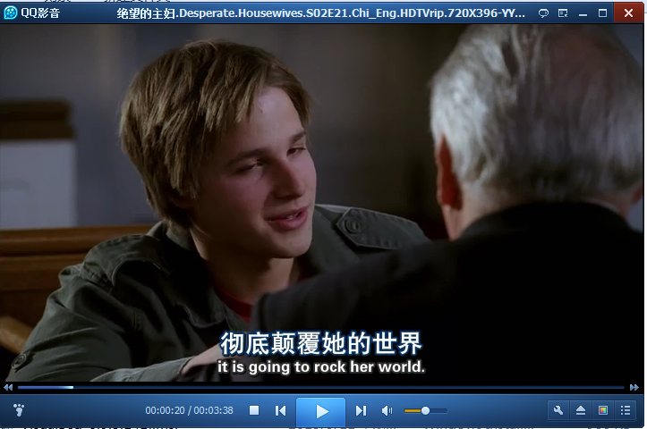
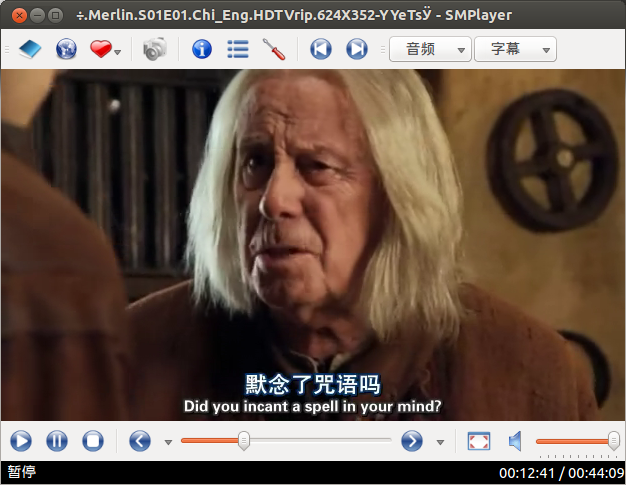
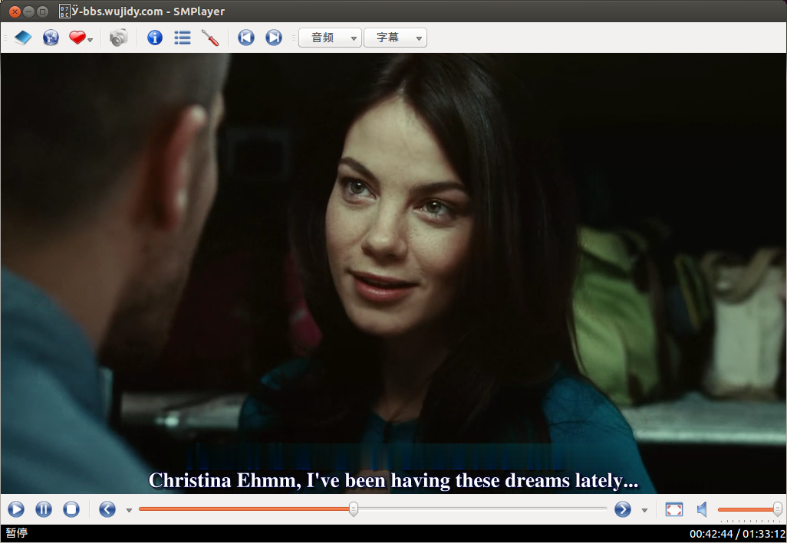

## 引言
现今我们可以接触到大量的英文影片和电视剧，追美剧和英剧，看这些电视剧其中一个原因也是希望借此可以提高自己的英文水平，包括听力和口语表达水平。纵然有很多英剧和美剧是下载到可以分离选择挂载中文字幕还是英文字母的视频版本（例如`.mkv`内封格式可以分离字幕），但是在很多情况下我们下载到的视频却是字幕被压制到视频中无法进行分离的（例如很多下载的压制视频还是`.rmvb`格式无法分离字幕），这样的话个人感觉在观看视频的时候很难不依赖于中文字幕，窃以为这样带有中文字幕的视频让人们更多地关注与故事情节而依赖字幕，这样的方式看英剧或者美剧未必对英文水平有多大提高。

因此很多人选择在观看的时候用手或者物品遮挡住屏幕中播放器的字幕部分，这未必不是一种可行的方法，但是这样的办法比较费劲。另有一些人可以用视频制作软件将字幕手动去除掉，但是对于多数人来讲还是麻烦一些。本篇在这里介绍一个小技巧可以不必这么做就能不看中文字幕。

## 简介
下面介绍的就是用播放器播放时去除屏幕上面的字幕，类似于播放器中视频滤镜的作用。


### Windows平台
首先来介绍Windows平台下的软件。其实Windows平台下最好办了，据笔者所知，国内的某款视频播放器已经集成了这个功能。下面来介绍如何使用:

**打开软件播放视频，滤镜前**

**右键->选项->开启**

**按照提示鼠标选区**

**滤镜后**
#### **注意**
该某影音由于非法使用`ffmpeg`的`GPL`协议发布的源代码，属于严重违反`GPL`协议的侵犯版权行为，被列入`ffmpeg`的耻辱柱。笔者对这种行为并不看好。[参见这里](http://bbs.kafan.cn/thread-765214-1-1.html)

### Linux平台
* 毕竟Windows平台并不是本文的重点，下面谈一谈Linux下什么播放器可以实现该功能。
* Linux下有名的播放器`mplayer`，`VLC`等等播放器，但是可能是因为老外们母语就是英文吧，不需要在看视频时去除什么字幕，在Google上面这么一搜索还真不好找到什么有用的信息，后来发现`mplayer`有一个`vf=×××`的视频滤镜参数，事实上这个选项类似于ffmpeag的`-vf`视频滤镜选项，在`-vf=`后面可以自定义一个视频滤镜,其中可以有这么一个选项`delogo=××:××:××:××:××`。
* `delogo`笔者从字面意思上理解认为应该是`delete logo`的意思，就是在播放时去除视频上面的图标比如说一些视频播放网站上右上角的那个水印图标以及电视中左上角的那个电视台标志。`delogo`可以指定一块矩形区域把它模糊化，本来是为了去除标志的，在这里我们同样可以拿它来去除中文字幕，由于字幕在视频中的位置比较固定，就是把中文字幕那片弄一个矩形模糊化就行了。

#### mplayer
* Ubuntu安装`mplayer`
```bash
sudo apt-get install mplayer
```
* mplayer启动代码
```bash
mplayer -vf "delogo=175:335:350:40:1" file.rmvb 
```
下面演示一下：

**过滤前**

**过滤后**

#### SMplayer
考虑到命令行操作还是有些不大方便，并且`mplayer`有很多优秀的图形前端，在这里我们可以使用`SMplayer`，并且令人高兴的是`SMplayer`可以在设置选项中选择给`mplayer`传参数，甚至单列出了视频滤镜的参数，我们可以达到相同的效果。
我们按照如下图进行设置

**点按首选项**

**高级->MPlayer选项->在视频滤镜输入`delogo`参数**

**过滤后**

**过滤前**

**说明**：参数应该是`delogo=x:y:w:h:s`的形式，其中`x`和`y`为矩形区域左上角的坐标值，`w`和`h`分别为矩形区域的宽和高，这几个参数需要根据实际情况不断调整，以确定矩形区域的位置和大小，不过一般字幕的位置还是比较固定，下面笔者总结出了几种常见大小格式视频的四个参数位置，可适用于大多数人人影视压制的英文视频影片;`s`则用于显示矩形边框，`s`为-1可以显示出矩形区域的边框方便调整。
    
    视频大小         命令行滤镜参数
    480X272        delogo=100:230:320:24:1
    624X352        delogo=155:300:350:29:1
    720x396(400)   delogo=175:335:350:40:1

**当然也可以在电影中遮挡字幕**

**当然也可以全部遮挡字幕**


### Mac OS平台
同样的道理，Mac OS下著名的视频播放器`MPlayerX`也是`mplayer`的前端，我们只用加上运行参数即可，依据如下设置：


## 总结
本文介绍了在全平台下面播放器遮挡字幕对应的方法，算是一种比较通用的方法（Windows下也有`mplayer`，修改安装目录下的`smplayer.in`即可加入命令行参数`vf=xxx`）。
在没有中文字幕的情况下可反复观看英文，有助于帮助提高英文水平。

参考：
([http://www.it.com.cn/edu/softhotnews](http://www.it.com.cn/edu/softhotnews/technews/2009/11/09/17/667304.html))

---

### 2016年10月11日更新

* 由于最新版本的`mplayer`接口有变化，取消了`vf=xxx`这样的接口，取而代之的是`vf-add xxx`来添加一个滤镜，如果您使用的是较新版本的`mplayer`（包括其各个图形前端程序），本文中所有的命令行参数应有所变更，例如：
```bash
mplayer -vf "delogo=175:335:350:40:1" file.rmvb
```
应变更为：
```bash
mplayer -vf-add "delogo=175:335:350:40:1" file.rmvb
```
例如`MPlayerX`中的传递给`mplayer`的选项那栏应由`-vf="delogo=155:300:350:29:1"`变更为`-vf-add "delogo=155:300:350:29:1"`

* Mac OS下最新版本的`MPlayerX`对`delogo`滤镜选项支持并不好，笔者没有测试成功（老版本是可以的），建议Mac OS用户直接用`Homebrew`安装`mplayer`命令行：
```bash
brew install mplayer
```
然后直接用`mplayer`命令行播放：
```bash
mplayer -vf-add "delogo=175:335:350:40:1" file.rmvb
```
有关`Homebrew`的安装请参见其官网：
([http://brew.sh/](http://brew.sh/))

* Mac OS 下的最新版`MPlayerX`现在可能安装一些附带软件，行为并不友好，建议用`mpv`（基于`mplayer`的增强版本）进行替代，并可使用其第三方的`delogo`插件实现该功能。
参见：
`mpv`官网：([https://mpv.io/](https://mpv.io/))
`mpv-delogo`插件地址：([https://github.com/b4zz4/mpv-delogo](https://github.com/b4zz4/mpv-delogo))
