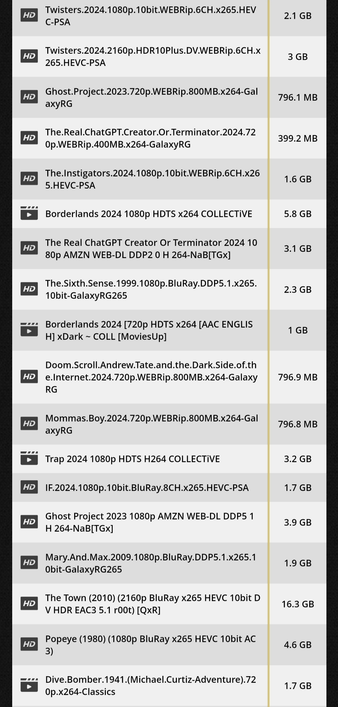

## 引言
如今自动化影视工具越来越多，作为影视剧库管理者有必要知晓一些音视频编码格式以及常见命名规则，事实上大多数影视种子名称里面已经包含了该影视文件的一些必要信息，一个例子如下：
> Interstellar.2014.1080p.BluRay.DDP5.1.x265.10bit-GalaxyRG265
## 电影基本信息
`Interstellar.2014` 电影名字（星际穿越）和上映年份。这部分数据通常被 `Plex/Emby/Jellyfin/Radarr` 等软件用来识别匹配到唯一的电影；现实中电影名字是允许重复的，但是同一年里面上映的电影很少有重名的，因此电影发行名称和年份这个信息基本可以匹配到唯一电影。
## 分辨率
例子里面为`1080p`，事实上因显示设备比例不同，可能还有许多其他分辨率格式，大致规律为例如1080p代表有1080行像素点。在许多地方我们也能见到诸如1080i这样的分辨率格式，1080p与1080i的区别在于前者为逐行扫描，后者为隔行扫描模式。一些地方使用电影载体来指代分辨率，例如DVD，不同载体对应分辨率见后；常见的分辨率有：
* 8k / 7680x4320
* 4k / 2160p / UHD / Ultra HD 通常是 4096x2160 或 3840x2160
* 2k / 1440p / QHD / Quad HD 通常是 2560x1440，但底线要求是 2048x1080
* 1080p / FHD / Full HD / 全高清 1920x1080
* 720p / HD / 高清 1280x720
* 576p / SDTV / 标清 1024x576 或 720x576 
* 480p / SDTV / 标清 720x480 或 640x480
* 360p / 640x360 或 480x360
* 240p / 320x240
* 144p / 192x144
  
* DVD: **480i、576i**
* HD DVD：**480i、576i、720p、1080i、1080p**
* 蓝光/Bluray: **1080p起步**
## 片源来源
`BluRay`代表片源来自于蓝光原盘，常见来源如下：
* `REMUX / Blu-ray / BluRay / BD`: 也就是所谓的「蓝光原盘」，通常是质量最好的一种。直接从蓝光光碟而来，REMUX的意思是无损的提取出原光盘里面的视频数据、音频数据，封装到我们熟悉的视频封装格式中，适合收藏。普通观影个人感觉没必要。但注意，若后边有 X.264 之类的编码类型，则实际上已经不是「原盘」了。一个单层的蓝光光盘的容量为25GB，足够录制一个长达4小时的高质量影片，因此此类视频文件普遍在几十G每影片的规模。带DIY字样的为对蓝光盘再加工，汉化菜单、添加中文字幕、中文音轨等方便非英文网友观看。
* `BDrip`: Blu-ray Disc Rip，BD 转制。同样来源于蓝光光盘，只不过进行了重新编码，采用 H.264 甚至 H.265 编码获得优秀的压缩比。质量略低于 BD 但文件较小，性价比很高。
* `WEB-DL`: 越来越流行的片源，质量第三，但是体积小了很多。全称为 web-download，是从官方发行的网络版直接搞下来的 （而不是屏幕录像） 。有些时候会加上具体的来源，例如 NF-WEB-DL 就是来自于 Netflix。
* `WEB-Rip`: 从官方发行的网络版屏幕录像或者重新编码转制得来，质量可能相对于WEB-DL稍差。
* `HDTV`: 常见于老电影。当时还没有 BD，流媒体也不流行。是数字采集 HD 电视得来的。在那个年代已经是最好的了。因为是电视，有可能会有台标。
* `HDTVrip / HDrip`: 类似 BDrip，来源还是 HD 电视的采集，但是重新编码了。同类类似的TVrip代表电视采集转录（但不一定为HD电视的采集）。
* `HR-HDTV`: HR-HDTV准确名字叫做Half Resolution High Definition Television=HRHD（HR or HR-HDTV），也就是大家所说的全高清的一半，所以HR-HDTV也叫半高清。这个概念被提出来后，主要随着人人影视（YYTs）的壮大而推广，被大家拟熟知。YYeTs人人影视在07年3月份的时候开始制定电影的HR-HDTV标准，并且做了很多实验电影发布，取得相当的好评，于是经过2008年10月最终修改后得到现在的HR-HDTV的固定标准。HR-HDTV是用DivX/XviD/x264等MPEG4压缩技术对HDTV的视频图像进行高质量压缩,然后将视频、音频部分封装成一个.avi或.mkv文件，最后再加上外挂的字幕文件而形成的视频格式。这里补充下，以前HR-HDTV多用HDTV的源，现在蓝光普及、获取也方便，多用蓝光片源，画质更优。但你看到下面的命名，你能知道是用的蓝光片源、还是HDTV片源，或WEB-DL片源吗？所以人人影视的资源有点“鱼龙混杂”，没有清晰的标注片源。举例说明：Puss.In.Boots.2011.穿靴子的猫.双语字幕.HR-HDTV.AC3.1024X576.x264-YYTs
* `HD-DVD`：HD DVD（或称：High Definition DVD）是一种数字光储存格式的蓝色光束光碟产品，与蓝光光碟（Blu-ray Disc）相似且在2008年以前互为竞争关系，2008年厂商不再支持，这场持续了数年的规格之争，最终以蓝光的胜利而告终。所以，HD-DVD已成历史名词，目前网上流传带有HDDVD的片源，基本是2009年以前发行的。
* `DVDRIP`: DVDRIP是从最终版的DVD转制，将DVD的视频、音频、字幕剥离出来，再经过压缩或者其他处理，然后重新合成成多媒体文件。一般来说，DVDrip由影音文件(后缀为avi)和字幕文件组成。
* `DVDScr`: 预览版的或者是测试版的DVD，非正式出版的版本。从预览版 DVD 中获取。比DVDRip早发布，但画质稍差。(经常有一些不在黑边里在屏幕下方滚动的消息，包含版权和反盗版电话号码 ，会影响观看。)在欧美年末颁奖季时，给评委送审的片子可能就是这种片源（毕竟片子还没发售，防止泄露不可能给评委看高清版），也难为那些评委了。如果没有严格的划分它的画质应与TC版差不多。
* `R5`: 心急的您可以看这个，DVD联盟为保护知识产权，将全世界依地理区域分为1-6区，若与影碟机的区域码不符，则可能无法播放。当然网上盗版都是经过破解，压制成.mkv、.avi格式后再分享的。5区R5一般大都是俄罗斯5区版，由于北美大片在俄罗斯发行的语种经常配音为俄罗斯语，因此网络上会出现采用R5的视频+枪版TS的英语原声音频=合成版本(所以音效差)，有时俄版也会有英语音频，视情况而定了。但是，R5版不只是音效差，绝大部分情况视频质量也比欧美版DVD也差。R5区的DVD发布一般较欧美版早。现在蓝光普及，DVD已很少见，以上说的情况在蓝光也适用，BluRay在全球也分区发售，有些电影俄版也较美版发行早。
* `TC`: 胶片版。TC使用电视电影机从胶片直接数字拷贝。画面质量还不错,但亮度不足，有些昏暗。很多时候制作TC使用的音源来自TS，因此音质很差，但画面质量远好过TS。TC也可以与一些分辨率组合例如HDTC。
* `TS`: TS与CAM版的标准是相同的。 但它使用的是外置音源(一般是影院座椅上为听力不好的人设的耳机孔)，这个音源不能保证是好的音源，因为受到很多背景噪音的干扰。TS是在空的影院或是用专业摄像机在投影室录制，所以图象质量可能比CAM好。但画面的起伏很大。常出现的有一般TS版和经过修复清晰TS版。TS也可以与一些分辨率组合例如HDTS。
* `CAM`: CAM通常是用数码摄像机从电影院盗录。有时会使用小三角架，但大多数时候不可能使用，所以摄像机会抖动。因此我们看到画面通常偏暗、人物常常会失真，视频画面时常会出现倾斜、抖动。由于声音是电影院现场录制，所以经常会录到观众的笑声等杂音。因为这些因素，图象、声音质量通常都很差。CAM也可以与一些分辨率组合例如HDCAM。
## 视频编码
常见的编码格式如下：
* `MPEG-2`: MPEG-2不是MPEG -1的简单升级，MPEG-2在系统和传送方面作了更加详细的规定和进一步的完善。MPEG-2特别适用于广播级的数字电视的编码和传送，被认定为SDTV和HDTV的编码标准。DVD影碟就是采用MPEG-2压缩标准。
* `VC-1`: VC-1是软件巨头微软力推的一种视频编码的格式，总的来说，从压缩比上来看，H.264的压缩比率更高一些，也就是同样的视频，通过H.264编码算法压出来的视频容量要比VC-1的更小，但是VC-1 格式的视频在解码计算方面则更小一些。
* `MPEG4(XviD开源编码器/DivX)`: 由于MPEG4只处理图像帧与帧之间有差异的元素，而舍弃相同的元素，因此大大减少了合成多媒体文件的体积。应用MPEG4技术的影音文件最显著特点就是 压缩率高且成像清晰，一般来说，一小时的影像可以被压缩为350M左右的数据，而一部高清晰度的DVD电影, 可以压缩成两张甚至一张650M CD光碟来存储。
* `H.264/AVC(x264编码器)`: H.264是由国际电信联盟（iTU-T）所制定的新一代的视频压缩格式。H.264的数据压缩比能比当前DVD系统中使用的 MPEG-2高2～3倍，比MPEG-4高1.5～2倍。
* `VP8`: 是一个开放的格式，由Google主导以替代VP7，同时Google也发布了VP8编码的实现函数库：libvpx，与之搭配WebM为一个容器格式，搭配声音格式则是使用Vorbis。
* `VP9`: 是Google为了替换老旧的VP8影像编码格式并与MPEG主导的H.265/HEVC竞争所开发的免费、开源的影像编码格式。VP9主要被用于Google旗下著名的影音分享网站YouTube，VP9一般与Opus音频编码一起以WebM格式封装。
* `PRORES`: Apple ProRes 是苹果公司开发的高品质的有损影片压缩格式，可用于高达8K的后期制作。它是 Apple Intermediate Codec 的后继产品，于2007年与 Final Cut Studio 2 一起推出。ProRes系列编码器使用基于离散余弦变换(DCT)技术的压缩算法，类似于 H.26x 和 MPEG 标准。ProRes被广泛用于广告、纪录片、蓝光和流媒体中高清广播文件的最终交付编码。
* `H.265/HEVC(x265编码器)` 是一种较新的编码格式。x265是一个开源项目，是一个将视频编码为H.265/高效率的视频编码（HEVC）格式的免费的库。H.265理论上会比H.264更节省空间，理论上能减小一半体积，但编码时间长点，所以压制小组在压制时要花更多时间。但存储体积减小一半，也是很有吸引力的。并且，X265编码的视频对播放器解码能力要求也高。
* `AV1`: 是一个开放、免专利的影片编码格式，为网络流传输而设计。它由开放媒体联盟（AOMedia）开发，目标是取代其前身VP9，该联盟由半导体企业、视频点播供应商和网页浏览器开发商于2015年成立。2018年，Facebook进行接近真实使用环境条件测试，测试结果显示AV1资料压缩率与x264 main profile、x264 high profile和libvpx-vp9相较之下，分别提升50.3%、46.2%和34.0%。
## 视频色深
`10bit`，常见的还有 `8bit`。代表像素点色彩空间使用几个bit表示。
我们知道计算机中所有颜色都是由红绿蓝（RGB）混合而成。每一种颜色称为一个通道。色深就是每个通道用多少空间去表示。所以，色深越大颜色表达的越精细，渐变也就越平滑。
8bit 是最常见的。三个通道就是 24bit，即所谓的「24 位真彩色」，一共约能表示出 1670 万种颜色。如果是 10bit，就能组合出 10.7 亿色。
不过不是所有显示器都支持 10bit 显示的，如果不支持，即使是 10bit 的视频，观感也和 8bit 一样。
另外，虽然直观上 10bit 版本的视频文件会更大。但实际上它们往往有更好的压缩率，所以有可能 10bit 的电影反而比 8bit 的要小。
## 色彩动态范围
`HDR` 与SDR相对，简而言之画面高光亮处更亮，暗处更暗，画面对比动态范围更宽；因为自然界的太阳光强度最亮和最暗处光强动态范围极大，远大于屏幕二极管灯光亮度控制范围，因此HDR高光更亮更贴近自然界人眼视觉，画面更生动真实。等常见HDR标准有：
* `HDR10`: 由美国消费者技术协会推出，开源、免费的标准。HDR10 是 HDR 的基础标准，所有的 HDR 设备都支持，也是目前应用支持最广泛的 HDR 标准。但是 HDR10 采用的“静态元数据”技术，信号记录的是亮度的绝对值，就导致了如果你的设备达不到亮度就会进行削峰，比如说一台最大亮度为1000尼特的显示器，它如何处理高达4000尼特视频中的高光，那就只能裁掉1000尼特以上的部分。值得注意的是：HDR10 标准是对峰值亮度「Peak luminance」是没有硬性要求的，这给了很多硬件厂商可乘之机，市面上不少号称 HDR10 的显示器实际仅仅只能播放 HDR 片源，根本达不到真正的 HDR 效果。
* `Dolby Vision / DV / 杜比视界`: 由杜比实验室推出，与 HDR10 不同 Dolby Vision 采用了“动态元数据”技术，使得每一帧都获得了比较准确的最高和最低亮度，对设备硬件的要求也是更为苛刻，而且每台设备厂商都需要向杜比视界支付授权费用。要达到杜比世界标准的播放要有几个必要条件：片源为杜比世界相关格式、硬件设备有杜比世界的认证，包括处理器与显示器播放软件都要有杜比认证，如果用没有经过认证的设备来播放，就可能会出现应收错误，无法正常解码等问题。即使需要支付昂贵的授权费用，但由于杜比视界极其惊艳的显示效果，目前已有不少厂商选择使用，包括常见的 LG、TCL、Philip、Sony 等品牌的部分电视机型，都可支持 Dolby Vision 杜比视界。
* `HDR10+ / HDR10PLUS`: 由三星、亚马逊、松下和20世纪福斯等公司联合推出的，可兼容 HDR10，具有与杜比视界相似的优势，但不收取版权费用。HDR10+ 可以看做 HDR10 的升级，添加了“动态元数据”技术，即为每一帧或每一段视频的内容指定亮度和对比度的信息。
* `HLG`: HLG（全称 Hybrid Log Gamma），由英国 BBC 和日本 NHK 联合发起，特点是没有元数据，可以同时兼容 HDR 显示屏和目前最为普及的 SDR 显示屏，且兼容性特别好，并且是一个完全免费的标准，在高清广播电视系统里面有着广泛的应用，也获得了部分流媒体的支持。
* `HDR Vivid`:HDR Vivid 是 UWA 世界超高清视频产业联盟（原 CUVA ），以华为海思的技术为主导，推出的一个中国独创的 HDR 新标准，支持动态元数据，可以对画面信息进行帧级调整。2022年初，国家广播电视总局发布了《高动态范围电视系统显示适配元数据技术要求》（GY/T 358-2022）行业标准，该标准的核心技术已实现在超高清视频内容制作、编码、接收、解码、显示等端到端的全产业链布局，并以 “HDR Vivid” 自有品牌名称开展产业化推广，也标志着 HDR Vivid 成为国家广电行业的标准。简单来说，HDR Vivid 视频标准是一个完整的产业链标准，包含了内容制作、编码传输和终端显示等产业链端到端各个环节。观众可以通过支持 HDR Vivid 的视频平台和终端，观看到更丰富的超高清影视内容，体验到更沉浸的视觉享受。
## 音频格式
`DDP5.1`是声音格式，它一般有两部分，前者DDP为音频编码（DDP见下文阐述），后者5.1代表声道形式：5方向声道加1个重低音声道，适配5.1功放音响系统，5.1系统也可写作`6CH`；同理7.1系统也可写作`8CH`；2.0系统（只有左右声道）也可写作`2CH`；CH是英文单词channel的缩写，代表一共有几个声道。常见声音编码有：
* `MP3`: 这种压缩方式的全称叫MPEG Audio Layer3,MP3是利用MPEG Audio Layer 3的技术，将音乐以1:10甚至1:12 的压缩率，压缩成容量较小的file，换句话说，能够在音质丢失很小的情况下把文件压缩到更小的程度。而且还非常好的保持了原来的音质。
* `AAC`: Advanced Audio Coding。一种专为声音数据设计的文件压缩格式，与MP3不同，它采用了全新的算法进行编码，更加高效，具有更高的“性价比”。利用AAC格式，可使人感觉声音质量没有明显降低aac标志的前提下，更加小巧。AAC属于有损压缩的格式，与时下流行的APE、FLAC等无损格式相比音质存在“本质上”的差距。加之，传输速度更快的USB3.0和16G以上大容量MP3正在加速普及，也使得AAC头上“小巧”的光环不复存在了。
* `WMA`: WMA的全称是Windows Media Audio，是微软力推的一种音频格式。WMA格式是以减少数据流量但保持音质的方法来达到更高的压缩率目的，其压缩率一般可以达到1:18，生成的文件大小只有相应MP3文件的一半。
* `WAV`:WAV是录音时用的标准的windows文件格式，文件的扩展名为“.wav”，WAVE文件作为最经典的Windows多媒体音频格式，应用非常广泛。声道有单声道和立体声之分，采样频率一般有11kHz、22kHz和44kHz三种。
* `ATRAC`:ATRAC压缩技术主要是利用了人耳的蔽遮效应，在心理声学原理上，在进行音频录入的同时，有许多外部的频段同时也会被录入，当人耳同时听到两个不同频率、不同音量的声音时，音量较小的低频及音量较小的高频连同不为人耳所察觉的频段信号都会被自动减弱或忽略不予记录，因此又可以称为适应性变换声码技术，由于近年來编码压缩技术（ATRAC的版本）越來越成熟，所以经过编码解码过程后的声音仍直逼CD。
* `FLAC`: FLAC与MP3不同，MP3是音频压缩编码，但FLAC是无损压缩，也就是说音频以FLAC编码压缩后不会丢失任何信息，将FLAC文件还原为WAV文件后，与压缩前的WAV文件内容相同。
* `OGG/VORBIS`: OGG格式的全称应该是OGG Vobis。它是一种新的音频压缩格式，类似于MP3等现有的音乐格式。但有一点不同的是，它是完全免费、开放和没有专利限制的。OGG Vobis有一个很出众的特点，就是支持多声道，OGG Vobis在压缩技术上比MP3好，而且它的多声道，免费，开源这些特点，使它很有可能成为一个流行的趋势，这也正是一些MP3播放器对其支持的原因。可以对所有的声道进行编码，而不是MP3只能编码2个声道。多声道音乐的兴起，给音乐欣赏带来了革命性的变化，尤其在欣赏交响时，会带来更多临场感。这场革命性的变化是MP3无法适应的。在以后的播放技术不断提高以后，而且人们对音质要求不断提高，Ogg的优势将更加明显。
* `OPUS`: Opus是一个有损音频压缩的数字音频编码格式，由Xiph.Org基金会开发，之后由互联网工程任务组（IETF）进行标准化，目标是希望用单一格式包含声音和语音，取代Speex和Vorbis，且适用于网络上低延迟的即时声音传输，标准格式定义于RFC 6716文件。Opus格式是一个开放格式，使用上没有任何专利或限制。在多个听觉盲测中，Opus都比MP3、AAC、HE-AAC等常见格式，有更低的延迟和更好的声音压缩率。
* `APE`: APE的本质，其实它是一种无损压缩音频格式。庞大的WAV音频文件可以通过Monkey”s Audio这个软件进行“瘦身”压缩为APE。有时候它被用做网络音频文件传输，因为被压缩后的APE文件容量要比WAV源文件小一半多，可以节约传输所用的时间。更重要的是，通过Monkey”s Audio解压缩还原以后得到的WAV文件可以做到与压缩前的源文件完全一致。所以APE被誉为“无损音频压缩格式”

**以下4K蓝光原盘中可以使用的音频格式，也是目前电影里面最常用的字眼格式**
* `杜比数字(Dolby Digital / DD / AC3)`: 这个音频格式从DVD开始就为人们所熟知。并深受欢迎，几乎成了环绕声的代名词。杜比数字(以AC-3著称)是蓝光光盘的基本标准之一。虽然它可以提供高达640kb/s的最大比特率(普遍认为与在相同比特率下的DD+难以听出区别)。但是它的L作方式与其在DVD上一样，可以配置从1.0到5.1声道的形式。  
* `DTS`: 这个格式有时也称作 DTS Encore(虽然DTS公司自己观来不再使用这个称呼)。也是另一个从标准DVD时代遗传来的东西。然而，蓝光光盘可以支持它更高的15Mb/s 比特率形式同杜比数字一样，所有蓝光光盘播放机都被要求支持DTS。其数据流通过数字连接传输，并且包括至少2声道的内部解码，而大多数播放机可以内部解码达51声道。  
* `杜比数字+(DD+ / DDPLUS / DDP / EAC3 / 早期曾译作杜比数字增强) `: 这是标准杜比数字的增强版本，它提供更高的比特率和效率更高的压缩，声音质量也再一次得到提升。它可以支持多达7条分立的电影声道(老实讲。绝大多数好莱坞电影只做5.1声道的录音)。在蓝光光盘中，DD+是作为“核心”杜比数字声轨的外延来编码的。DD+格式在蓝光音频格式中是可选的，并不要求所有光盘播放机都支持。许多播放机只简单地读出640kbs核心。而忽略外延部分。多数电影制片厂愿意使用基本的杜比数字或其它更先进的格式，如杜比 TrueHD等。我只知道《天堂美乐( A View From Space with Heavenly Music)》是DD+声轨。实际上那是一部音乐片，但是画面是从卫星上眺望地球的种种美景。外包装和菜单的正确标注就是 Dolby Digital Plus。
* `DTS-HD HR(High resolution audio高分辨率音频)`: 与杜比数字+相似。DTS-HDHR提供比标准DTS更高的比特率和更好的压缩改进。DTS-HDHR也是给“核心”DTS声轨增加外延的方法来编码的(注重，DTS HDHR通常被简称为“DTS-HD”，因此有可能引起混淆和误导)。因为这编解码方式也是蓝光视盘的可选格式。许多播放机只提取1.5Mb/s的DTS核心，而忽略其外延。  
* `PCM`: PCM声轨是录音棚母版的严格复制品，不用任何压缩地把信号编码到光盘上。好处是保留了原材料的纯净性。没有任何由于压缩带来的保真度损失。坏处是不压缩的音频轨将占用庞大的光盘空间。这会对电影的视频质量产生负面影响(特别是在单层BD25光盘中)。虽然蓝光格式是有能力采用高达24比特清晰度的PCM音频。但是电影制片厂因为原始素材的量化深度和保留带宽的需要，仍然选择在16比特下进行编码(请注意。把24比特量化的母版转換量化深度到16比特。在技术上与压缩不是一回所有蓝光光盘播放机都支持PCM音频格式。在节目支持方面，索尼、迪斯尼的所有蓝光光盘版本和狮门影业等其它电影制片厂出版的部分蓝光光盘节目都应用PCM声轨。  
* `杜比 TrueHD`: 杜比 TrueHD是“无损”的压缩编解码技术,虽然它因为压缩而比PCM声轨占用较少的磁盘空间。但一且解码后，它仍然与录音棚母版每一相应比特都一样(由电影制片厂决定用16比特还是24比特量化深度，或称分辨率或清晰度)。上面提到过，如果把这个过程当作我们熟知的电脑文件压缩方式会有助于我们理解。假定把一条PCM 声轨文件做了这种文件压缩，生成压缩文件。而一旦用原来的压缩软件解压后。可以得到与原始PCM文件百分之百相同的副本。不会损失任何声音质量。杜比 TrueHD在蓝光光盘中是可选格式。而且，由于 TrueHD没有采取核心加外延的配置形式来建立。所以在蓝光光盘中，记录 TruehD声轨必须伴有一条标准杜比数字AC-3声轨，以保证与那些没有 TrueHD支持的蓝光播放机兼容。所以在蓝光光盘包装封底标志处。一定会观到 TrueHD和杜比数字两个标识同时出现。脍炙人口的影片很多都采用这种音频格式，像《鬼魂车手》和《第五元素(再版)》等等。  
* `DTS-HDMA(Master Audio / 音频母版)`: 这是又一种与杜比TrueHD相似的无损压缩格式。二者之间的区别在于DTS HDMA在以核心加外延的形式建立(就像 DTS-HD HR一样)， DTS-HD MA声轨也因此比 TrueHD轨道占去更多的光盘空间。可是它不需要为反向兼容而再占用一条从属的标准核心声轨。由于 DTS-HD MA和 TruehD都是无损压缩。它们都与录音棚母版质量百分之百相同。从而两者的声音质量也是一模一样的。像 DTS-HD HR那样。MA格式只是蓝光视盘的可选格式。如果播放机不支持 DTS-HD MA。它就只提取标准DTS核心。据说福克斯家庭娱乐公司出版的电影蓝光版都采用格式。
* `杜比全景声(Dolby Atmos)`: 杜比作为音效的技术标准之一，始终走在环绕声技术的最前列。推出的杜比全景声（Dolby Atmos）是很多家庭影院设备的标配，在流媒体和游戏领域也有广泛应用。与传统的5.1、7.1基于声道的声音解决方案不同，杜比全景声是一种基于声音对象的3D环绕声技术。“基于声音对象”是什么意思？更形象地说，影片中所有的声音，比如说汽车的鸣笛、激烈的打斗、树叶的摆动等等，杜比全景声可以准确地确定声音应该在哪，并精确地控制声音位移，营造出动态效果，这就是“基于声音对象”。而以往“基于声道”的解决方案，声音制作过程需要考虑扬声器的设置，比方说声音是右侧还是左侧环绕声、右后还是左后环绕声。杜比全景声的优势就在于，接收器就会自行判断、利用现有的扬声器重塑身临其境的声音效果，比基于声道的5.1、7.1音响系统更灵活、适应性更强。
* `DTS:X`: DTS也是音效的技术标准之一。从时间上看，DTS公司在2015年才推出DTS:X技术，因为推出时间晚于杜比全景声，所以很多消费者更乐于接受杜比全景声，因为支持杜比全景声的设备和片源要远高于DTS:X。不过，DTS:X技术依然拥有比肩杜比全景声的实力。它旨在打造一种多维、逼真、生动的沉浸式环绕声效果，但又有不同的环绕声规范布局。在我们理解的杜比全景声里，它是地面、天空2层音箱布局，对天空扬声器也有摆放位置和角度的要求。DTS:X则不然，虽然也是2层架构，但对置顶环绕音箱可以摆放得更灵活，既可以作为地面扬声器的增高摆位，也可以摆出不同的倾斜角。DTS:X自身能够向下兼容，所以它可以应用在传统的5.1或7.1配置上，不需要为了新的技术另外购买新的环绕声套装，甚至买新的蓝光播放机。另外对于那些支持 DTS:X 的电影光盘，你拥有的是旧设备的话，也可以把它当成 DTS-HD Master Audio 标准来播放。
## 发布组信息
`GalaxyRG265`代表发布组名称，不同发布组压制视频有不同风格，在此不过多赘述。NOGRP 表示来源不明，类似于「佚名」「群星」。
## 发行商/电视台信息
有的电视剧集片源还带有发行商和电视台信息，例如：
* `ATVP`: Apple苹果原创剧集。
* `NF`: Netflix原创剧集。
* `AMZN`: Amazon原创剧集。
* `DSNP`: Disney原创剧集。

以上电视发行商片源普遍对多语言字幕支持较好，片源内封自带各国语种字幕，推荐下载此类片源省去找字幕。
## 帧率
电影最常见的帧率是24 帧/秒（电影产业标准）和30 帧/秒。随着高刷新显示装置的流行，一些压制组压制了`60FPS`或`120FPS`后缀的视频种子文件，码率相对更高。
## 封装容器/后缀
常见视频文件的容器/后缀: 
* `rmvb`: RMVB由于很多年没有更新编码，再加上当初开发RMVB是为了做网络流媒体的，所以使用RMVB来压制高清是没有意义的，当RMVB码率达到1500KB以上就没有任何优势，甚至是出现劣势，因为算法关系，RMVB在处理细节和动态场景上是模糊的，无法展现细节，再加上他的音频是编码过的RA格式，严重丢失原声。按理来说RMVB是早就应该淘汰的格式了，只有在中国这种特殊环境才得以生存。
* `avi`: 廉颇老矣，AVI英文全称为Audio Video Interleaved，即音频视频交错格式。是将语音和影像同步组合在一起的文件格式。它对视频文件采用了一种有损压缩方式，但压缩比较高，因此尽管面面质量不是太好，但其应用范围仍然非常广泛。(就目前来看，随着观众对电影品质要求的提升，且mkv格式的普及，AVI格式越来越力不从心了，新片基本很少有人压avi格式了)。现在，AVI在DVD时代很普遍，但现在高清普及了，已经很少、很少有人会压制AVI格式的高清资源。
* `flv`: (Flash Video) 是Adobe 公司推出的一种流媒体格式，由于其封装后的音视频文件体积小、封装简单等特点，非常适合于互联网上使用。 目前主流的视频网站基本都支持FLV。 采用FLV 格式封装的文件后缀为.flv。 直播场景下拉流比较常见的是http-flv 直播流，具有延时低，易传输等特点。从一些流媒体网站上直接下载的视频流可能是这种格式。
* `webm`: WebM 是一种开放的多媒体封装格式，通常与一些特定的视频和音频编码格式一起使用。WebM 最常用的视频编码格式是 VP8 和 VP9，而音频编码格式通常使用 Vorbis 或 Opus。
* `mov`: 高清预告片首选，它是Apple公司开发的一种音频、视频文件格式。QuickTime文件格式支持25位彩色，提供150多种视频效果，并配有提供了200多种MIDI兼容音响和设备的声音装置。它无论是在本地播放还是作为视频流格式在网上传播，都是一种优良的视频编码格式。QuickTime因具有跨平台、存储空间要求小等技术特点，得到业界的广泛认可。现在MOV格式常常被用来制作高清电影预告片，可以达到1080P的所谓全高清标准。
* `mp4`: 手机、平板的新宠儿，有的电影是MP4格式的，这代表着它采用了MPEG-4视频压缩编码，但是具体是哪一种编码格式并不确定，一般来说是DIVX或者XVID。一般是用在掌上便携设备上（IOS/安卓平台，如手机、平板）播放。
* `ts`: 这个TS代表的是文件后缀名为.TS的高清格式。这种格式的优点在于对硬件的要求不高，即使是1080P的电影这两年的家用电脑都可以轻松播放，不过缺点同样明显——超大的文件体积。
* `mkv`: 后起之秀，MKV不是一种压缩格式，而是一种新的多媒体封装格式，也称多媒体容器 (Multimedia Container)。它可将多种不同编码的视频及16条以上不同格式的音频和不同语言的字幕流封装到一个Matroska Media文件当中。MKV最大的特点就是能容纳多种不同类型编码的视频、音频及字幕流。MKV不同于DivX、XviD等视频编码格式，也不同于MP3、Ogg等音频编码格式。MKV只是为这些音、视频提供外壳的“组合“和“封装”格式。换句话说就是一种容器格式，常见的 AVl、VOB、MPEG、RM 格式其实也都属于这种类型。但它们要么结构陈旧，要么不够开放，这才促成了MKV这类新型多媒体封装格式的诞生。
## 音轨语言信息
* `Dual.Audio/Dual-Audio`: 双语音轨。
* `Tri-Audio`: 三语音轨。
* `Multi`: 多语种音轨。
* `CHINESE/RUSSIAN/KOREAN/HINDI/FRENCH`: 使用语言名称直接标记出片源所包含的非英语单音轨。
* `DUBBED`: 片源包含译制音轨，例如原电影为西班牙语电影，有人译制成英语并且配音加入到片源音轨当中，播放此片源时听到的是译制的英语音轨而非演员原声。
## 字幕信息
### 内挂/内封字幕
封装到了资源文件中，但可通过播放器选择切换不同的字幕、隐藏字幕、调整字幕字体、时间轴等，包括`SRT`、`ASS`、`PGS`、`MOV_TEXT`等格式。
### 外挂字幕
字幕网站下载到的字幕文件，如sub，ass，srt，拖到播放器中就能使用，与内挂类似。
外挂字幕一般有以下几种格式：
* `SRT`: 最基本最流行的纯文本字幕。具体的颜色字体字号等可以由播放器即时调整。个人强烈推荐这个。
* `SSA`: 可以设置文字大小/效果，甚至添加水印，但难以由用户自定义。
* `ASS`: SSA 增强版。
* `SUP`: 图像版外挂字幕。
* `SUB与IDX`: 不常见。

外挂字幕也有一些特定后缀格式，例如：
* 语言后缀: `.zh.srt`代表中文字幕，`.en.srt`代表英文字幕。
* 优先级/数量后缀: `.zh.2.ass`代表第二个(优先级PLEX可识别)中文字幕。
* 为听力障碍者准备的字幕后缀: `.hi`代表Hearing-Impaired，`.cc`代表Close Captioned，`.sdh`代表Subtitles for the Deaf or Hard-of-Hearing。
### 硬字幕
又称内嵌字幕，就是把字幕跟画面一起压成了视频了，像水印一样，无法隐藏。
对于带硬字幕的片源，种子一般有以下字眼：
* `SUBBED`: 画面内有不能消去的硬字幕，常见还会标记硬字幕语言如ENG-SUBBED或简繁双语字幕等。
* `UNSUBBED`:没有内嵌字幕 与 SUBBED 对比。
## 剧集/季信息
电视节目种子分为两类，分别是整季（Season Pack）打包和单集种子。
前者一般包含`Season 01/S01/S1`等字眼表示第一季（例）打包，此字眼会作为关键词被SONARR识别到下载哪一整季。两个例子：
> Westworld S01 Season 1 Complete HDTV 720p x265 AAC E-Subs [GWC]

> Solar.Opposites.S05.720p.10bit.WEBRip.2CH.x265.HEVC-PSA

后者包含`S01E02`等字眼表示第一季的第二集单集（例），有的也可包含多集例如`S01E01-E03`表示第一季的第一集到第三集共三集，此字眼会作为关键词被SONARR识别到在下载哪一（几）集。例子：
> Loki.S01E01.1080p.DSNP.WEBRip.DDP5.1.Atmos.x264-NOGRP

注意一些动漫类的种子没有“季”的概念（或者说都是第一季全部只有一季），只有剧集编号，此也可被SONARR识别，例子：
> Na Nare Hana Nare.[06][1080p][WebRip][x264_AAC][简体内嵌]

一些综艺节目的剧集编号以播出日期替代（少见），例子：
> The Genius.2013.20150912.1080p.x264
## 种子大小信息
一些发布组例如GalaxyRG265会在种子标题包含视频文件大小信息，例如`800M`代表影视文件压制大小在800M左右，以此类推。
## 其它杂项
* `WP/WORKPRINT`: 来自于工作录影带 有时是导演最终剪接版，有时是未完成版本，留有一些额外镜头。
* `PROPER`: 完美版 强调优于早期另一个 Group 出的版本。
* `R-RATE`: 有删节。
* `UNRATE`: 未删节 通常也用于强调，与 R-RATE 对比。
* `Theatrical.Cut`: 剧场版（影院上映版本）。
* `LIMITED`: 限制级版，LIMITED电影指该电影只在有限的电影院放映，通常少于250家。通常较小的电影(比如艺术电影)的发行是LIMETED。
* `Director.Cut/DC`: 导演剪接版 一般正式上映版还要通过审查剪辑，哪个国家都有这个程序。
* `Extended`: 加长版，情形和导演剪辑版类似，很多的加长版是用来圈钱的,有的干脆就是把花絮里的删除段落直接加进去,也就长了几分钟而已。也有很厚道的,比如指环王的加长版,一部就加长了近50分钟,肯定对剧情有影响的。
* `IMAX`: 所谓巨幕，IMAX(即Image Maximum的缩写，意为“最大影像”)是一种能够放映比传统胶片更大和更高解像度的电影放映系统。整套系统包括以IMAX规格摄制的影片拷贝、放映机、音响系统、银幕等。标准的IMAX银幕为22米宽、16米高，但完全可以在更大的银幕播放，而且迄今为止不断有更大的IMAX银幕出现。许多热门大片有普通和IMAX两种版本。
* `Anniversary.Edition`: 周年纪念版，某某周年纪念版。
* `CEE/EUR`: 中欧/欧版等，跟DVD光盘类似，蓝光光盘在全球也是分区的，某区的光盘不能在其他区的光驱上播放，或有次数限制 。一般分为美版、CEE版（中欧版)、韩版、日版、港版、台港、中国大陆版等多个版本。 其中美版大多画质和音效的配备较高，当然也不是绝对、也有不少节目是各国版本画面、音效一致，不同版本主要是在字幕语言和多国语言音轨的配置方面。如阿凡 达就是各国版本音画一致。但美版大多没有中文字幕，而CEE中欧版则多会加入中文字幕，因此受到很多国内用户的喜爱。港版、日版等也大多配置中文字幕，但多数是繁体中文字幕，中国大陆版一般会添加简体中文字幕及普通话国语音轨。区分这些不同国家的版本，主要还得从BD Info信息来看画面码率、音轨配置、及字幕语言等详细信息来判断那个版本更为适合。现全球范围内发行的蓝光版本为：1 **大区**EUR,CEE,US,NODIC 2 **部分国家地区**UK,FRA,GRE,HK,TW,JPN,KR

> EUR：是指在整个欧洲范围发行，字幕以英语为主，包括欧洲其他国家的小种语言，但是近来在欧洲的亚洲移民较多，同时也考虑到向亚洲范围内发行，所以现在部分EUR版蓝光有了中文，韩文，日语等字幕。
> CEE：是指中欧国家经济体，也就是包括了中欧以及东欧地区的小国家，这个地区发行的蓝光原盘中文字幕较多。  而且有时画质也比其他区的好，极具有收藏价值。
> US：是指美版蓝光，通常是在美国以及美洲地区首发，英语字幕为主，但为了照顾美洲其他国家，同时也有西班牙字幕，部分美版蓝光也有中，日，韩等字幕，因片而异。
> NODIC：是指北欧地区，丹麦，挪威，冰岛等国家，这种版本的蓝光通常连英语字幕都没有，只有北欧国家的鸟语字幕，更不用说中文字幕了。很少见。
> HK及TW：港版和台版，现在蓝光在香港以及台湾普遍的开始陆续发行，色戒，集结号等在港台上映的影片均发行了蓝光，欧美大片在港台发行已经有了相当数量，并面向东南亚地区发行，港台版本影片一般含有中文字幕（包括简体和繁体），卡通片以及纪录片带国语音轨也较多。
> JPN,KR：日版和韩版。部分蓝光有中文字幕，甚至有国语音轨。因片而异。
> UK,FRA,GRE：是指英国，法国，德国，这三个国家发行的蓝光均面向本土，故没有中文字幕，以英文字幕，法语字幕，德文字幕为主。

* `REMASTERED/4K`: 重新灌录版/4K版，Remastered主要用于CD，意为重新缩混的版本、重新灌录。电影资源现在也引入这个词语，尤其是4K蓝光版是。许多老片蓝光修复、或4K蓝光修复、或某某周年纪念版时。
* `Open.Matte`: 满屏版和普通版本的的区别在于：画面比例。例如《泰坦尼克》最初的BD版是1998年公映版，1998年的泰坦尼克采用的是传统胶片拍摄，画面比例为2.35:1，之后的16:9版本是2012年重映版，2012年重映采用了IMAX修复技术，修改画面比例为1.78:1，前者画面大小相对后者较小，后者的画面更加大，同一个镜头下能够容下更多的内容。两者并没有片长或者片质上的区别。
* `WITH.EXTRAS`: 带花絮。
* `WITH.OST`: 带原声音乐CD。
* `REPACK`: 修正版本。
* `RECODE`: 对另一个Group已经发布的版本进行修正的版本 较少见，因为 MovieZ一般鼓励自己寻找片源，有时候也写成REPACK。
* `WS`: Wide Screen: 16:9宽屏幕版本的影片，推荐WS版本，因为FS是从WS中截下来的。
* `FS`: Full Screen: 4:3 全屏幕版本的影片 有些影片DVD同时有WS和FS两种版本，DVDRip也会有两种)。
* `DVDR`: 由DVD直接复制而来，没有经过压缩，保留原始 MPEG2 视频编码。
* `DivX`: 视频编码为DivX 3.11 alpha DivX 4/5为利用法律漏洞在自由软件 DivX 3.11 alpha 基础上发行的商业软件，被 TDX 抛弃。
* `SVCD`: 视频编码为MPEG2，且帧率和长宽比符合 SVCD 标准 SVCD刻录到普通 CD 光盘介质上可以用家用 SVCD 或 DVD 播放机播放。
* `NUKED`: 画质太差或有其他严重问题，被Top Site FTP管理员废除掉 别人加的标记，但有可能是发行Group主动要求的
* `Bad IVTC`: 帧率错误，画面有不可去除的拉丝。
* `BAD A/R/Bad Aspt`: 画面比例不正常
* `INTERLACED`: 隔行(可看见横的扫描线)

## 实战环节
以下是一个种子网站的随机截图，现在应该可以通过标题了解种子信息了吧。

参考链接：
https://www.bilibili.com/read/cv34408411/
https://www.cnblogs.com/PBDragon/p/4810982.html
https://zh.wikipedia.org/wiki/VP8
https://zh.wikipedia.org/wiki/VP9
https://zh.wikipedia.org/wiki/AV1
https://zh.wikipedia.org/wiki/Opus
https://zh.m.wikipedia.org/wiki/Apple_ProRes
https://www.nxrte.com/jishu/32742.html
https://github.com/0voice/audio_video_streaming/blob/main/article/012-%E5%B8%B8%E8%A7%81%E9%9F%B3%E8%A7%86%E9%A2%91%E7%BC%96%E7%A0%81%E6%A0%BC%E5%BC%8F.md
https://www.hao4k.cn/thread-31731-1-1.html
https://www.sohu.com/a/638671599_120931436
https://zhuanlan.zhihu.com/p/337850228
https://blog.einverne.info/post/2015/05/what-is-0day-and-what-is-pt.html